```dot
digraph PatentFigure {
    rankdir=TB;
    bgcolor=white;
    fontname="Arial";
    node [fontname="Arial", fontsize=14, fontcolor=black, color=black];
    edge [fontname="Arial", fontsize=11, fontcolor=black, color=black];
    
    // Your nodes and edges here — see shape specs below
    
    label="图1";
    labelloc="b";
    fontsize=12;
}
```

# Patent Figforge

Write Graphviz DOT for patent figures (USPTO/CNIPA). Requires `dot` (Graphviz).

## Required Dependencies

This skill requires Graphviz to be installed:

**Windows**: `choco install graphviz`
**Linux**: `sudo apt install graphviz`
**Mac**: `brew install graphviz`
**Python**: `pip install graphviz`

## Workflow

### Step 1: Determine diagram type

| User says | Type | Direction | Node shapes |
|-----------|------|-----------|-------------|
| 流程图/方法/flowchart | **Flowchart** | `rankdir=TB` | ellipse → box → diamond → ellipse |
| 框图/系统/block diagram | **Block Diagram** | `rankdir=TB` | All `shape=box` |
| 架构/层级/hierarchy | **Hierarchy** | `rankdir=TB` or `LR` | `shape=box`, `rank=same` |

🔴 **CHECKPOINT**: confirm type before Step 2. If unsure, show this table to user.

### Step 2: Write DOT

Write DOT following shape & line rules in `references/`. Boilerplate:



Skeletons: `assets/flowchart-skeleton.dot`, `assets/block-diagram-skeleton.dot`.

### Step 3: Render

```bash
dot -Tsvg diagram.dot -o output.svg
```

`-Tpng`, `-Tpdf`. Engines: `-Kneato` / `-Kfdp` / `-Kcirco` / `-Ktwopi`.

🔴 **CHECKPOINT**: verify (a) exit=0 (b) SVG>0 bytes (c) opens correctly. Fail → see Failure Modes.

### Step 4: Checklist

🛑 **STOP · BLOCKING GATE**: run 12-item checklist below. **Do NOT deliver until all pass.**

## Critical Rules

- `shape=box` (**sharp**, NEVER rounded), B&W only, no color fills
- Flowchart: `rankdir=TB`, box w/h ≥ 3:1, diamond w/h ≈ 2:1, flat ellipse start/end
- Block diagram: sensor=solid, processor=solid, storage=`dashed`, decision=`dotted`, output=`solid, penwidth=1.5`
- Lines: 0.5–0.8pt outlines, 0.3–0.4pt lead lines
- Font: 14pt box text, 10–12pt labels/numbers
- Reference numbers **outside** boxes, thin dotted lead lines, no arrowheads
- `label="图1"`, `labelloc="b"` — no title on diagram

## 🛑 Pre-Submission Checklist (BLOCKING)

```
☐ 1. Black lines, 0.5–0.8pt          ☐ 7. No extra text outside boxes
☐ 2. Font ≥14pt                       ☐ 8. Lines don't cross boxes (safe channels)
☐ 3. DPI≥300, legible at 2/3 scale    ☐ 9. Consistent proportions
☐ 4. Arabic numbers, lead lines, outside  ☐ 10. No smudges
☐ 5. Lead lines clockwise, no cross    ☐ 11. B&W only, no color fills
☐ 6. "图1" below diagram              ☐ 12. Same component same number across figures
```

## 🚫 Anti-Patterns (DO NOT)

| # | Don't | Sev | Do instead |
|---|-------|:---:|------|
| 1 | Rounded corners | 🔴 | `shape=box` |
| 2 | Lines >1.5pt | 🔴 | 0.5–0.8pt |
| 3 | Arrows through boxes | 🔴 | Safe-channel routing |
| 4 | Numbers inside boxes | 🔴 | Outside + lead lines |
| 5 | Color fills | 🔴 | White fill, B&W |
| 6 | Title on diagram | 🟡 | Only "图1" below |
| 7 | Lead lines cross | 🟡 | Clockwise, `constraint=false` |
| 8 | Box w/h ≈ 1:1 | 🟡 | ≥ 3:1 |
| 9 | Tall diamond | 🟡 | Flat, w/h ≈ 2:1 |
| 10 | Gradients/shadows | 🟡 | Pure black lines |

## Failure Modes

| Symptom | First fix | Still failing? |
|---------|-----------|----------------|
| `dot: not found` | Install Graphviz (see Dependencies) | https://graphviz.org/download/ |
| Syntax error | Check quotes, semicolons, `->` | Simplify to minimal skeleton |
| Blank SVG | Verify `bgcolor=white`, labels exist | Try `-Tpng` |
| Chinese garbled | `fontname="Arial"` | Fall back to English labels |
| Lead lines overlap | `constraint=false`, `weight=0` | Note: manual editing in vector editor |

## References

- `references/shape-specs.md` — flowchart & block diagram shape tables, layout rules, arrow routing
- `references/patent-standards.md` — USPTO/CNIPA paper, margin, font, line specs, output formats
- `references/numbering.md` — numbering conventions, lead line specs, DOT implementation, examples
- `assets/flowchart-skeleton.dot` — copy-paste flowchart template
- `assets/block-diagram-skeleton.dot` — copy-paste block diagram template
