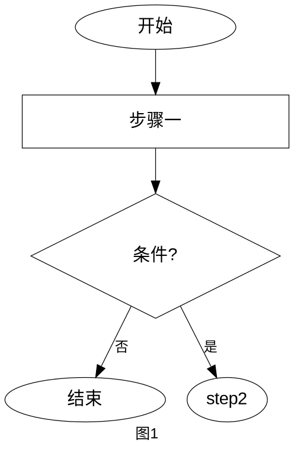
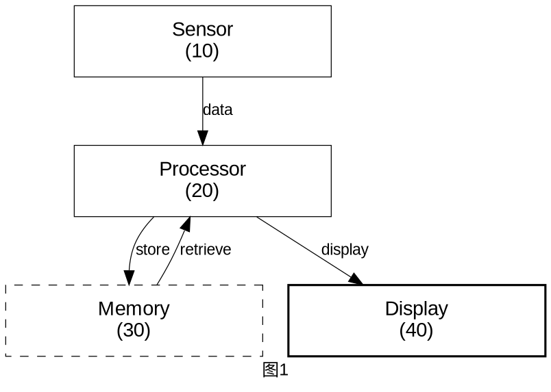

# Patent Figforge — 专利附图生成器

Generate patent-ready technical diagrams by writing Graphviz DOT code directly. No external Python scripts needed — this skill provides the **knowledge** (shapes, layout, numbering, line specs), you write the DOT.

## When to Use

Invoke this skill when users ask to:
- 画专利流程图 / Create flowcharts for method claims
- 画系统框图 / Generate block diagrams for system claims
- 画架构图 / Draw system architecture diagrams
- 加引线标注编号 / Add reference numbers with lead lines to diagrams
- 生成专利附图 / Generate patent figures (USPTO / CNIPA)

## What This Skill Does

1. **Flowchart Generation**:
   - Method step flowcharts
   - Decision trees
   - Process flows with branches
   - Patent-style step numbering

2. **Block Diagram Creation**:
   - System component diagrams
   - Hardware architecture diagrams
   - Software module diagrams
   - Component interconnections

3. **Custom Diagram Rendering**:
   - Render Graphviz DOT code
   - Support multiple formats (SVG, PNG, PDF)
   - Multiple layout engines (dot, neato, fdp, circo, twopi)

4. **Patent-Style Formatting**:
   - Add reference numbers (10, 20, 30, etc.)
   - Use clear labels and connections
   - Professional formatting for USPTO filing

## Required Dependencies

This skill requires Graphviz to be installed:

**Windows**:
```bash
choco install graphviz
```

**Linux**:
```bash
sudo apt install graphviz
```

**Mac**:
```bash
brew install graphviz
```

**Python Package**:
```bash
pip install graphviz
```

## Workflow

This skill provides **patent drafting knowledge** — you write Graphviz DOT code directly and render with the `dot` command. No intermediate Python API.

### Step 1: Determine diagram type

| 用户说 | 图类型 | DOT 方向 | 节点形状 |
|--------|--------|----------|---------|
| 流程图/方法/步骤/flowchart | **Flowchart** | `rankdir=TB` | ellipse → box → diamond → box → ellipse |
| 框图/系统/模块/block diagram | **Block Diagram** | `rankdir=TB` | All `shape=box`, border styles differentiate types |
| 架构/层级/hierarchy | **Hierarchy** | `rankdir=TB` 或 `LR` | `shape=box`, nested with `rank=same` |

### Step 2: Write DOT code with patent rules

Write DOT code following the shape specs, layout rules, and line specs in this skill. Key boilerplate:

```dot
digraph PatentFigure {
    rankdir=TB;
    bgcolor=white;
    fontname="Arial";
    node [fontname="Arial", fontsize=14, fontcolor=black, color=black];
    edge [fontname="Arial", fontsize=11, fontcolor=black, color=black];
    
    // Your nodes and edges here — see shape specs below
    
    label="图1";
    labelloc="b";
    fontsize=12;
}
```



### Step 3: Render with dot command

```bash
dot -Tsvg diagram.dot -o output.svg
```

Also available: `-Tpng`, `-Tpdf`. Use `-Kneato` / `-Kfdp` / `-Kcirco` / `-Ktwopi` for alternative layout engines.

### Step 4: Run pre-submission checklist

Go through the 12-item checklist at the bottom of this skill. Fix any violations before finalizing.

## Quick-Start Templates

Copy-paste these skeletons and fill in your content:

### Flowchart skeleton


### Block diagram skeleton


## Shape Types — 专利附图形状规范

### Flowchart Shapes（方法流程图）

| 形状 | 专利用途 | Graphviz | 绘制要点 |
|------|---------|----------|---------|
| 椭圆 | 起止（Start/End） | `shape=ellipse` | **扁椭圆形**，非正圆 |
| 矩形 | 处理步骤 | `shape=box` | **宽高比 ≥ 3:1**（专利惯例），直角 |
| 菱形 | 判断分支 | `shape=diamond` | **扁平菱形**（宽高比 ≈ 2:1） |
| 平行四边形 | 数据 I/O | `shape=parallelogram` | 倾斜角 10–15° |
| 双线矩形 | 子程序/数据库 | `shape=box, peripheries=2` | 外框+内框 |
| 圆柱 | 数据库/存储 | `shape=cylinder` | — |

**关键禁止**:
- ❌ 禁止圆角框（非专业工程图风格）—— 使用直角 `shape=box`
- ❌ 禁止渐变、阴影、装饰性元素
- ❌ 禁止彩色填充（B&W 模式）

### Flowchart Layout（流程布局规范）

```
✓ 竖向绘制（top-to-bottom），rankdir=TB
✓ 同层节点居中对齐
✓ 层间间距 ≥ 2 倍节点高度
✓ 决策分支出/入点：是→菱形右尖，否→菱形左尖
✓ 箭头路径：垂直段 → 水平段（在层间隙中）→ 垂直段
```

**箭头路由铁律**:
```
禁止（箭头穿过其他框）：        正确（走安全通道）：
┌───┐                          ┌───┐
│ A │──╲                        │ A │
└───┘   ╲  ← 穿过 B!           └─┬─┘
┌───┐     ╲                      │
│ B │──────▶ C                 ┌─▽─┐
└───┘                          │ B │────────▶ C
                               └───┘
水平段必须在层间隙中穿行，永远不进入任何框的边界
```

### Block Diagram Types（系统框图）

| 组件类型 | 边框样式 | Graphviz |
|---------|---------|----------|
| 传感器/输入 | 实线 (─) | `style=solid` |
| 处理器/控制器 | 实线 (─)，标准线宽 | `style=solid` |
| 存储器/数据库 | 虚线 (--) | `style=dashed` |
| 判断逻辑 | 点划线 (-·-) | `style=dotted` |
| 输出/显示 | 实线 (─)，加粗 | `style=solid, penwidth=1.5` |

**框图布局规范**:
```
✓ 网格排列（2–3 列）
✓ 同行框顶/底对齐，等宽
✓ 行间留「安全通道」（lane）供连线走行
✓ 所有水平连线在安全通道中（行间隙的中点 Y 坐标）
✓ 垂直连线从框边锚点直出
```

## Layout Engines

- `dot`: Hierarchical (top-down/left-right)
- `neato`: Spring model layout
- `fdp`: Force-directed layout
- `circo`: Circular layout
- `twopi`: Radial layout

## 专利附图通用规范

> 基于 USPTO 37 CFR §1.84、CNIPA 审查指南 §4.3 及专利代理行业惯例

### 纸张与边距

| 规范项 | USPTO | CNIPA |
|--------|-------|-------|
| 纸张尺寸 | A4 或 US Letter | A4 (210×297mm) |
| 上边距 | ≥25mm (1 inch) | 无硬性规定 |
| 左边距 | ≥25mm | 同上 |
| 右边距 | ≥15mm (5/8 inch) | 同上 |
| 下边距 | ≥10mm (3/8 inch) | 同上 |
| 图编号 | `Fig. 1`, `Fig. 2`... | `图1`, `图2`... 标于图正下方 |

### 颜色与照片

- 颜色：**黑白线条图**（彩色需 petition/审查员同意）
- 照片：一般**禁止**（除非唯一可行方式，如金相/电泳）
- B&W 模式下：**白色填充，黑色线条，无任何色彩**

### 字体与字号

```
CNIPA 审查指南：字高 3.5–4.5mm ≈ 五号至小四号 ≈ 14–17pt
USPTO：足够清晰可辨，实际建议 ≥ 12pt
```

| 元素 | 推荐字号 |
|------|---------|
| 框内主文字 | **14pt** |
| 图号标签（"图1"） | **14–16pt** |
| 引线标注数字 | **10–12pt** |
| 箭头旁标签 | **10–12pt** |

### 线条规范

| 元素 | 线宽 |
|------|------|
| 形状轮廓 | **0.5–0.8pt**（细线=专业） |
| 引线 (lead lines) | **0.3–0.4pt**（更细） |
| 连接箭头 | **0.5–0.8pt** |

**线条禁止行为**:
| 行为 | 判定 |
|------|:--:|
| 直线穿越模块框体 | ❌ 绝对禁止 |
| 线条交叉 (crossing lines) | ⚠️ 应避免，无法避免用跳线桥接 |
| 线条过粗 (>1.5pt) | ❌ 儿童画质感 |
| 多余的装饰性元素 | ❌ 禁止（无圆角/渐变/阴影） |

### 缩放要求

- CNIPA: 缩小至 **2/3** 仍能清晰分辨细节
- PNG: DPI ≥ **300**
- 线条均匀清晰，足够深，无涂改

## Output Formats

| 格式 | 适用场景 | 要求 |
|------|---------|------|
| **SVG** | 编辑、归档 | 矢量优先，推荐格式 |
| **PDF** | 正式提交 | USPTO/CNIPA 直接提交 |
| **PNG** | 预览、嵌入 | DPI ≥ 300 |

- `svg`: Scalable Vector Graphics (best for editing)
- `png`: Raster image (good for viewing)
- `pdf`: Portable Document Format (USPTO compatible)

## Patent-Style Reference Numbers (Lead Lines) — 专利图最核心特征

引线是将标记号连接到对应部件的细线——这是专利图区别于普通流程图的核心特征。

### Numbering Convention

**层级编码（推荐）**:
- `100` — 整体系统
  - `110` — 子系统 A
    - `111` — 部件 A1
    - `112` — 部件 A2
  - `120` — 子系统 B
    - `121` — 部件 B1

**线性编码（简单图）**:
- `10, 20, 30, 40...` — 主要组件
- `12, 14, 16...` — 10 的子组件
- `22, 24, 26...` — 20 的子组件

**规则**:
- 标记号为阿拉伯数字
- 位数不超过**四位数**（过长降低可读性）
- 同一部件在全篇文件中标记号一致

### Lead Lines 引线规范

引线是将标记号连接到对应部件的细线——这是专利图区别于普通流程图的核心特征。

| 规范 | 说明 |
|------|------|
| 引线位置 | **框外**标注，编号绝不写在框内 |
| 引线长度 | 适中，不宜过长（不长于 1.5 倍框高） |
| 引线排列 | **顺时针**排列（符合阅读习惯） |
| 引线交叉 | **不得交叉** |
| 引线样式 | 建议**曲线**，方便排列且与主线条区分 |
| 引线线宽 | **0.3–0.4pt**，明显细于形状轮廓 |
| 标记号位置 | 引线末端，框外 |

**正确 vs 错误**:
```
正确：                          错误：
┌─────────────┐                 ┌──────────────────────┐
│  Component  │── (110)         │  Component (110)     │  ← 编号挤在框内
└─────────────┘   ↑细引线       └──────────────────────┘
                 ↑标记号在框外
```

Example labeling:
```
"Input Sensor (10)"
"  - Detector Element (12)"
"  - Signal Processor (14)"
"Central Unit (20)"
"  - CPU Core (22)"
"  - Cache (24)"
```

## Presentation Format

When delivering diagrams to the user:

1. **State what was generated**: "Created a patent-style flowchart for the BMS balancing method with 5 steps."
2. **Show the DOT code** (so user can modify and re-render)
3. **Show output file path** and format (SVG/PNG/PDF)
4. **List reference numbers** used:
   ```
   Reference Numbers:
   - Input Module (10)
   - Processing Unit (20)
   - Output Interface (30)
   ```
5. **Confirm checklist passed**: "Pre-submission checklist: 12/12 passed."

## 提交前检查清单 (Pre-Submission Checklist)

生成专利图后，逐项核对：

```
☐ 1.  线条：黑色、均匀、足够深（0.5–0.8pt）
☐ 2.  字体：≥ 14pt（CNIPA 五号字标准）
☐ 3.  缩放：缩小至 2/3 仍清晰可辨（DPI ≥ 300）
☐ 4.  编号：阿拉伯数字，引线连接，框外标注
☐ 5.  引线：顺时针排列，不交叉，不长于 1.5 倍框高
☐ 6.  图号：标注在附图正下方（"图1" / "Fig. 1"）
☐ 7.  无多余文字：框外无注释性文字（除编号外）
☐ 8.  线条不穿框：所有连线在层间隙/安全通道中
☐ 9.  比例一致：同图内所有框比例尺统一
☐ 10. 无涂改：线条清晰、均匀
☐ 11. 无着色：B&W 模式下无任何色彩填充
☐ 12. 一致性：同一部件在全篇文件中标记号一致
```

## 常见错误 (Common Errors)

| 错误 | 影响 | 修正 |
|------|------|------|
| 编号写在框内 | 不符合专利惯例 | 移至框外 + 引线 |
| 线条过粗 (>1.5pt) | 看起来像儿童画 | 改为 0.5–0.8pt |
| 箭头穿过其他框 | 致命制图错误 | 安全通道路由 |
| 引线交叉 | 混乱、不专业 | 顺时针排列 |
| 框宽高比 ≈ 1:1 | 文字拥挤 | 改为 3:1 以上 |
| 菱形高窄 | 不美观 | 扁平菱形，宽高比 2:1 |
| 使用圆角框 | 非专业工程图风格 | 直角框 `shape=box` |
| 图上加标题 | 专利图不这么做 | 仅底部 "图1" |
| 彩色填充（B&W 模式） | 不符合提交要求 | 白色填充 |

## Common Use Cases

1. **Method Claims** → Flowcharts
   - Show sequential steps
   - Include decision branches
   - Number steps (S1, S2, S3...)
   - Follow layout: TB direction, safe-channel arrow routing

2. **System Claims** → Block Diagrams
   - Show components and connections
   - Use reference numbers with lead lines (框外标注)
   - Indicate data flow directions
   - Use border styles to distinguish component types (not colors)

3. **Architecture Diagrams** → Custom DOT
   - Complex system layouts
   - Multiple interconnections
   - Hierarchical structures

## Failure Modes & Recovery

| 症状 | 一线修复 | 仍失败则 |
|------|---------|---------|
| `dot: command not found` | 安装 Graphviz: `choco install graphviz` (Win) / `apt install graphviz` (Linux) / `brew install graphviz` (Mac) | 告知用户手动安装，提供官网 https://graphviz.org/download/ |
| `dot` 渲染报语法错 | 检查 DOT 代码：引号配对、分号结尾、箭头 `->` 语法 | 简化 DOT 到最小骨架测试，逐段加回定位问题 |
| SVG 输出空白/残缺 | 检查 `bgcolor=white`、节点有无 `label`、`rankdir` 是否正确 | 用 `dot -Tpng` 试 PNG 输出，排除 SVG 渲染器问题 |
| 中文乱码/方块 | 确认 `fontname="Arial"` 或系统已安装中文字体 | 改用英文 label，或指定系统已知中文字体路径 |
| 引线重叠/交叉 | 用 `constraint=false` + `weight=0` 放松引线约束 | 接受 Graphviz 自动布局限制，标注「需在矢量编辑器中微调引线位置」 |
| 输出文件过大 | PNG: 降低 DPI；SVG: 简化节点数 | 分拆为多个子图（Fig. 1A, Fig. 1B） |

## Tools Available

- **Bash**: Run `dot` command to render DOT → SVG/PNG/PDF
- **Write**: Save `.dot` source files and rendered diagrams
- **Read**: Inspect existing diagrams or DOT templates
