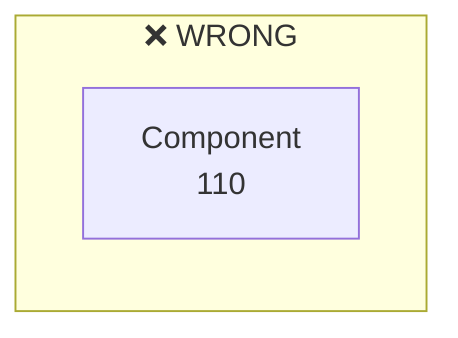

# Reference Numbers & Lead Lines

Lead lines connect reference numbers to components — the defining feature that distinguishes patent figures from ordinary diagrams.

## Numbering Convention

### Hierarchical encoding (recommended)

- `100` — Overall system
  - `110` — Subsystem A
    - `111` — Component A1
    - `112` — Component A2
  - `120` — Subsystem B
    - `121` — Component B1

### Linear encoding (simple diagrams)

- `10, 20, 30, 40...` — Main components
- `12, 14, 16...` — Sub-components of 10
- `22, 24, 26...` — Sub-components of 20

### Rules

- Reference numbers are Arabic numerals
- Maximum **4 digits** (longer reduces readability)
- Same component gets same number across all figures in the document

## Lead Line Specs

| Spec | Requirement |
|------|-------------|
| Position | **Outside** the box — numbers never inside boxes |
| Length | Moderate, ≤ 1.5× box height |
| Arrangement | **Clockwise** (conforms to reading habit) |
| Crossing | **Must not cross** |
| Style | Curved preferred (distinguishes from main lines) |
| Width | **0.3–0.4pt**, visibly thinner than shape outlines |
| Number position | At end of lead line, outside box |

### Correct vs Wrong

**WRONG — number crammed inside box:**


> Number inside the box — violates patent convention.

**CORRECT — number outside with thin lead line:**


> ✅ Number outside box, connected by thin dotted lead line.

### DOT Implementation

```dot
// Reference numbers as plaintext nodes
r10 [label="10", shape=plaintext, fontsize=11];

// Invisible edges for alignment
edge [style=invis];
{ rank=same; r10; component_node; }

// Lead lines: thin, dotted, no arrowhead, constraint=false
edge [style=dotted, penwidth=0.35, arrowhead=none, constraint=false, color=black];
r10 -> component_node;
```

### Example Labeling

```
Input Sensor (10)
  - Detector Element (12)
  - Signal Processor (14)
Central Unit (20)
  - CPU Core (22)
  - Cache (24)
```
