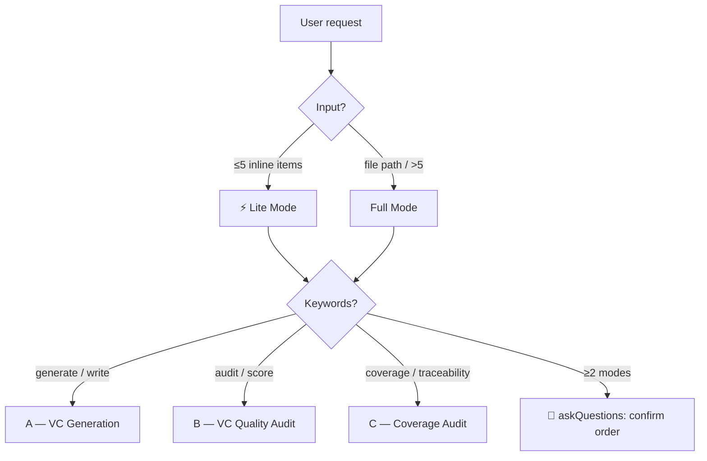

# 🎯 Verification Criteria — Generator & Auditor

> **Your ASPICE auditor just rejected your verification criteria.**
> This skill makes any AI agent write VC that passes first time — testable, traceable, and auditor-grade.
> Aligned with **ASPICE SYS.2 BP5** · **ISO/IEC 29148** · **VC-First** methodology.

<p align="center">
  
  
  
  
  
  
  
</p>

<p align="center">
  <strong>
    <a href="#-the-problem">The Problem</a> ·
    <a href="#-quick-start">Quick Start</a> ·
    <a href="#-three-modes">3 Modes</a> ·
    <a href="#-battle-tested">Battle-Tested</a> ·
    <a href="#-v-model--aspice-mapping">V-Model Mapping</a> ·
    <a href="#-vc-first-methodology">Methodology</a>
  </strong>
</p>

---

## 💥 The Problem

Your team just spent 3 months writing system requirements. They pass review. Then the ASPICE auditor opens the verification criteria:

| ❌ What the auditor sees | ✅ What they need |
|---|---|
| "Verify CAN wake-up is working" | "In ECU Sleep, VBAT=12V, send CAN NM frame ID=0x7DF, measure Wake pin rise time ≤100ms, N=100, 0 failures" |
| "System responds adequately" | "Response ≤100ms [R: REQ-014], at -40°C / +25°C / +85°C [D: REQ-003]" |
| "Test once, it's fine" | "N=298 for 99% confidence with 0 failures [S: ISO 26262-5 Table 5]" |

**Generic LLMs write the left column.** They paraphrase requirements, use subjective words like "adequate", invent numbers with no source, and skip coverage audits entirely. This skill forbids all of that — and replaces it with ASPICE-auditor-grade discipline.

---

## 🚀 Quick Start

```bash
# Install (Agent Skills / skills.sh)
npx skills add UnknowCao/autoskill-hub --skill verification-criteria

# Or manual: copy this folder into your agent's skills directory
git clone https://github.com/UnknowCao/autoskill-hub.git
# → point agent at autoskill-hub/skills/verification-criteria/SKILL.md
```

Then just ask — the skill auto-routes:

```
为 BMS_System_Requirements.md 的每条需求生成验证标准    → Mode A
审核 existing_vcs.xlsx 的 VC 质量，打 SMARTR-OC 分     → Mode B
检查 req.md 与 vc.md 之间的覆盖率和遗漏                  → Mode C
```

---

## 🏆 Battle-Tested

Not a demo. This skill has processed **5,000 real BMS system requirements**, producing **4,975 verification criteria** with full SMARTR-OC scoring and traceability.

| Metric | Result |
|---|---|
| Total VCs generated | 4,975 |
| SMARTR-OC ≥ 6/8 (auditor-grade) | **92.6%** (4,605 / 4,975) |
| SMARTR-OC 8/8 (perfect) | **36.7%** (1,825 / 4,975) |
| SMARTR-OC 7/8 | 41.0% (2,039 / 4,975) |
| Requirement ↔ VC coverage | **100%** (4,975 / 4,975) |
| Verified by parallel dispatch | 40 sub-agents, 35 functional domains |

---

## English Description

**`verification-criteria`** is a framework-agnostic AI skill that injects real requirements-engineering discipline into any LLM agent — Claude Code, GitHub Copilot, Cursor, Codex, or anything that reads Markdown.

It solves the most common failure mode in automotive systems development: **requirements that pass review but whose verification criteria cannot actually be tested**. Generic LLMs produce VCs that paraphrase the requirement, use subjective words like "adequate", invent numbers with no source, or skip coverage audits entirely. This skill forbids all of that.

### Three modes, one skill

| Mode | What it does | Trigger |
|---|---|---|
| **A — VC Generation** | Writes a 5-element VC for every requirement, with verification method auto-matched, **Source Depth** tagging, and SMARTR-OC self-check | "generate / write / 生成 VC" |
| **B — VC Quality Audit** | Scores existing VCs on **SMARTR-OC (8 dims)** + **CK-01~CK-10 checklist**, returns Pass / Conditional / Revise / Blocked | "audit / review / 评分" |
| **C — Coverage Audit** | Builds a requirement ↔ VC traceability matrix, detects **UNCOVERED / ORPHAN** gaps, forces 100 % coverage | "coverage / traceability / 覆盖率" |

---

## 🌐 中文简介

**`verification-criteria`** 是一个**框架无关**的 AI Skill —— 把一份 `SKILL.md` + 配套参考文档与脚本加载进任意 LLM Agent（Claude Code / GitHub Copilot / Cursor 等能读 Markdown 的都行），让大模型真正胜任汽车电子系统需求的"验证标准"编写、审核与覆盖追溯。

它解决的是汽车电子开发最常见的失败模式：**需求能过评审,但根本无法测试**。通用 LLM 写出的 VC 要么复述需求、要么堆砌"良好/合理/足够"等主观词、要么凭空编造无来源的阈值、要么干脆跳过覆盖率审计。本 skill 把这些做法**全部列为禁止项**，并给出强制替代方案。

**三种模式，一个 skill**：A 模式**生成** VC（含验证方法自动匹配 + Source Depth 来源标注 + SMARTR-OC 自检）、B 模式**审核**已有 VC（SMARTR-OC 8 维评分 + CK-01~CK-10 清单）、C 模式做**覆盖追溯**（需求↔VC 矩阵 + UNCOVERED/ORPHAN 缺口检测，强制 100% 覆盖）。

---

## ✨ Key Features

- ✅ **VC-First** — every requirement is written *simultaneously* with its VC; untestable requirements get flagged `VC-BLOCKED` immediately, not after review
- ✅ **SMARTR-OC 8-dimension scoring** — Specific / Measurable / Attainable / Relevant / Time-bound / Realistic / Objective / Complete; **< 6/8 cannot exit**
- ✅ **Source Depth tagging** — every numeric value tagged `[R]` Regulation / `[D]` Derived / `[S]` Specified / `[E]` Empirical / `[A]` Assumption; **≥ 3 `[A]` = blocked**
- ✅ **Method auto-matching** — physical quantities → Test; algorithms → Analysis; layout → Inspection; HMI → Demonstration (never blanket "Test")
- ✅ **100 % coverage enforcement** — traceability matrix + UNCOVERED / ORPHAN / PARTIAL / UNLINKED detection
- ✅ **Parallel dispatch** — requirements > 50 auto-split by domain and processed by parallel sub-agents (`scripts/split_req.py` + `scripts/merge_vc.py`)
- ✅ **12 hard-coded anti-patterns** — subjective words, unsourced numbers, circular references, silent fallback… all forbidden with mandatory replacements
- ✅ **ASPICE / ISO 26262 aware** — ASIL → safety margin / Double-100 / test matrix; SYS.2 BP5 work products
- ✅ **Lite / Full / Speed Tier** — ≤ 5 inline items skip checkpoints; explicit "quick" request reduces display only, never quality

---

## 📊 What You Get

You'll see structured output like:

```
REQ-SYS-014  SOC估算精度 ≤±5%
  VC-SYS-014.1 | Method: Analysis + Test | Source Depth: [D][S][E] | SMARTR-OC: 7/8 ✅
  Condition: -40 °C / +25 °C / +85 °C, HIL对标精密SOC仪表
  Pass-Fail: |估算值 − 真值| ≤ 5% in all 3 thermal points

Coverage: 100% (28/28) — 0 UNCOVERED, 0 ORPHAN
```

If a requirement uses "fast" / "stable" / "adequate" → it is **blocked** until you replace it with `≤ / ≥ / =` + number + unit.

---

## 🧭 Three Modes



### Mode A — VC Generation

| Step | Action | On Failure |
|---|---|---|
| A.0 | Confirm source doc; scan existing VCs | No source / parse error → 🛑 |
| A.1 | Parse requirements, classify by type | > 50 → split by domain |
| A.2 | Match method via decision tree, fill 5 elements | Method mismatch → revision |
| A.2a | Tag Source Depth `[R][D][S][E][A]` | ≥ 3 `[A]` → 🔴 blocked |
| A.3 | SMARTR-OC self-check | < 6/8 → revise ≤ 3 times |
| A.4 | Coverage audit (forward + reverse + orphan) | < 100 % → cannot end |

### Mode B — VC Quality Audit

Single-pass scoring combining **SMARTR-OC** + **CK-01~CK-10**:

| Condition | Disposition |
|---|---|
| SMARTR-OC ≥ 6/8 **and** all CK ✅ | ✅ Ready for Peer Review |
| SMARTR-OC ≥ 6/8 **and** only 🟡 minor CK ❌ | ⚠️ Conditional Pass |
| SMARTR-OC < 6/8 **or** any 🔴 critical CK ❌ | ❌ Needs Revision |

### Mode C — Coverage Audit

| Defect | Meaning | Pause threshold |
|---|---|---|
| 🔴 **UNCOVERED** | Requirement has zero VC | > 30 % → fall back to Mode A |
| 🟡 **PARTIAL** | VC exists but aspect missing | — |
| 🔴 **ORPHAN** | VC points to a non-existent requirement ID | > 20 % → fix IDs first |
| 🟠 **UNLINKED** | VC has no requirement link at all | — |

Formula: `Coverage % = Covered Reqs / Total Reqs`. Target = 100 %.

---

## 🗺️ V-Model × ASPICE Mapping

This skill serves the **right wing of the V-model** and the **verification side of ASPICE**:

| V-Model Phase | ASPICE | This Skill's Role |
|---|---|---|
| SYS.2 System Requirements | **SYS.2 BP5** | Generate / audit VCs as the verification counterpart of every system requirement |
| SYS.5 System Verification | SYS.5 | VCs feed the qualification test campaign; traceability matrix is the evidence |
| SWE.1 / SWE.6 (software) | SWE.x | Same methodology applies at software level (reuse the skill) |
| Cross-cutting | ISO 26262 Part 4/5/6 | ASIL → safety margin, Double-100 test matrix, safety case evidence |

> In `autoskill-hub`, this skill is the canonical **verification-side companion** to requirements-authoring skills.

---

## 📐 VC-First Methodology

> **VC is the requirement's other half.** Requirement says *what*; VC says *how we prove it*.

Three pillars:

1. **Write VC simultaneously with every requirement** — not as an afterthought
2. **Treat VC writing as a design activity** — if the requirement isn't testable, push back and rewrite it
3. **Every VC must be engineer-readable in 10 seconds** — no abbreviations to decode

Three maturity markers:

| Marker | Meaning | Action |
|---|---|---|
| 🔴 `VC-BLOCKED` | Cannot write a VC at all | Rewrite the requirement |
| 🟡 `VC-PARTIAL` | VC covers only nominal conditions | Add boundary (-40 °C / +85 °C) + fault cases |
| 🟠 `VC-ASSUMPTION` | VC depends on an unconfirmed assumption | Record assumption explicitly + escalate |

---

## 📁 File Structure

```
verification-criteria/
├── SKILL.md                     # Entry point — the agent loads this first
├── README.md                    # You are here
├── test-prompts.json            # Validation prompts for regression testing
├── references/                  # Loaded on-demand by mode/step
│   ├── vc-workflow-a.md         #   Mode A full workflow
│   ├── vc-workflow-b.md         #   Mode B full workflow
│   ├── vc-workflow-c.md         #   Mode C full workflow
│   ├── vc-output-format.md      #   Output format source-of-truth
│   ├── vc-smartr-oc.md          #   SMARTR-OC 8-dim rubric
│   ├── vc-source-depth.md       #   [R][D][S][E][A] tagging table
│   ├── vc-safety-patterns.md    #   ASIL → margin / Double-100
│   ├── vc-sequence-guide.md     #   Multi-scenario sequence rules
│   ├── vc-report-templates.md   #   A.4 / B.4 / C.5 report templates
│   ├── vc-framework.md          #   VC-First theory
│   ├── vc-anti-patterns.md      #   Full anti-pattern library
│   ├── vc-exceptions.md         #   Fallback rules
│   ├── vc-hard-gates.md         #   11 hard gates for sub-agents
│   └── vc-subagent-prompt.md    #   Parallel dispatch prompt template
├── assets/
│   ├── vc-template.md           # 5-element VC template (4 types)
│   └── vc-checklist.md          # SMARTR-OC scorecard + CK-01~10
└── scripts/
    ├── split_req.py             # A.1a — split by domain (>50 reqs)
    └── merge_vc.py              # Parallel merge + stats + review
```

---

## ⛔ Anti-Patterns (12 hard-coded prohibitions)

A few highlights — full list in `references/vc-anti-patterns.md`:

| # | Forbidden | Why | Replace with |
|---|---|---|---|
| 1 | Restating the requirement as the VC | Zero information gain | Add method + condition + numeric criterion |
| 3 | "adequate" / "stable" / "robust" | No objective pass/fail | `≤ / ≥ / =` + number + unit |
| 5 | Blanket "Test" for every VC | Wrong method per requirement type | Decision tree: physics → Test; logic → Analysis; layout → Inspection |
| 6 | Inventing numbers with no source | Looks professional, untestable | Tag every value `[R]/[D]/[S]/[E]/[A]` |
| 8 | Silent fallback on errors | User never knows | Always report, then apply documented fallback |

---

## 🤝 Compatibility

- **Agents**: Claude Code, GitHub Copilot, Cursor, Continue, any agent that consumes `SKILL.md`
- **Inputs**: `.md` / `.xlsx` / `.csv` requirement and VC documents
- **Standards**: ASPICE v4.0 SYS.2 BP5 · ISO/IEC 29148 · ISO 26262 (all parts)
- **Languages**: English + 中文 (bilingual documentation)

---

## 📜 License

Licensed under the **Apache License 2.0** — see the repository root [`LICENSE`](../LICENSE).
Patent grant and NOTICE protection included; suitable for commercial and enterprise use inside automotive OEMs and Tier 1s.

---

## 🙏 Acknowledgements

Part of the [**autoskill-hub**](https://github.com/UnknowCao/autoskill-hub) project — the open skill hub that walks the entire automotive V-model, mapped to ASPICE.

Contributions welcome — new VCs, additional anti-patterns, and real-world case studies are especially appreciated. See [`CONTRIBUTING.md`](../CONTRIBUTING.md) at the repository root.
