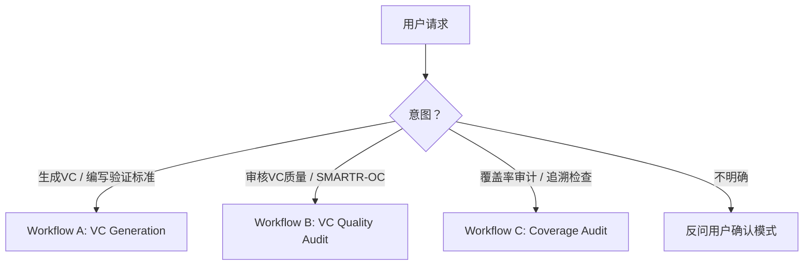

# Verification Criteria Generator & Auditor

Generate, audit, and trace VCs for functional system requirements. ASPICE SYS.2 BP5 / ISO/IEC 29148 / VC-First.

## Mode Selection

**模式判定规则（按关键词匹配，优先级从高到低）**：

| 用户说的关键词 | → 模式 | 理由 |
|---------------|--------|------|
| "生成"/"编写"/"创建" + VC/验证标准 | A | 明确是创建新内容 |
| "审核"/"评审"/"检查质量"/"SMARTR-OC"/"评分" | B | 明确是质量评估 |
| "覆盖率"/"追溯"/"traceability"/"覆盖矩阵"/"遗漏" | C | 明确是覆盖性审计 |
| "review" + "VC"（无"生成"/"创建"） | B | review 在 VC 语境下默认指质量审核 |
| "review" + "覆盖率"/"traceability" | C | 上下文指向覆盖性 |
| 混合意图（如"生成并检查覆盖率"） | 🔴 ASK | 先 A 后 C，用 `vscode_askQuestions` 确认执行顺序 |

**⚠️ 强制使用 `vscode_askQuestions`**：Never assume the user's intent. 每当需要确认模式或等待用户决策时，**必须**调用 `vscode_askQuestions` 工具，而非输出文字后等待用户手动回复。

**🚀 快速通道（Token优化）**：当关键词命中 **唯一** 模式（无混合意图）时，跳过 `vc-mode-selection` 确认，直接进入源文档确认（A.0/B.0/C.0），在文档确认的 `vscode_askQuestions` 中附加模式说明即可。仅在匹配到多个模式或匹配置信度不足时才进行模式确认。

模式确认提问格式（仅在必要时通过 `vscode_askQuestions` 调用）：

- **Header**: `vc-mode-selection`
- **Question**: "I need to confirm what you'd like me to do. Which mode should I use?"
- **Options**:
  - **A — 生成 VC**: 从需求文档生成新的验证标准
  - **B — 审核 VC 质量**: 对已有 VC 做 SMARTR-OC 评分和 CK 检查
  - **C — 覆盖率审计**: 检查 VC 对需求的覆盖完整性

🔴 **CHECKPOINT · 🛑 STOP** — 模式确认后，暂停向用户复述所选模式及下一步操作，调用 `vscode_askQuestions` 让用户确认后再加载对应 workflow 文件。**绝不自行跳转模式。绝不输出执行流程概要。**

## ⚡ Lite Mode — 快速内联处理（≤5条）

当用户在对话中**直接粘贴 ≤5 条需求或 VC**（非文件路径、非文件引用），自动进入 Lite Mode，跳过多轮 CHECKPOINT，一次性输出结果。

| 判定条件 | Lite Mode | Full Mode |
|---------|-----------|-----------|
| 输入方式 | 对话内直接粘贴文本 | 文件路径 / 文件引用 |
| 条目数量 | ≤5 | >5 |
| 源文档确认（A.0/B.0/C.0） | ⏭️ **跳过** | ✅ 必须 |
| Todo List 创建 | ⏭️ **跳过** | ✅ 必须 |
| 中间 CHECKPOINT（逐条/批量展示） | ⏭️ **跳过** — 直接输出最终结果 | ✅ 必须（≤10逐条，>10每10条） |
| 最终输出确认 CHECKPOINT | ⏭️ **跳过** — 输出后用户可追问 | ✅ 必须 |
| 质量门控（SMARTR-OC/Source Depth/反例扫描） | ✅ **必须执行** — 质量标准不降级 | ✅ 必须 |
| 覆盖率审计（A.4） | ✅ 内联展示覆盖率（≤5条无需矩阵） | ✅ 完整覆盖率矩阵 |

**Lite Mode 输出格式**：`[结果摘要表] + [逐条结果] + [质量标记]`，单条消息输出，不拆分多轮。

**触发升级**：Lite Mode 执行中发现 ≥3 VC-BLOCKED 或覆盖率 <100% → 暂停 Lite Mode，提示用户切换 Full Mode 做完整处理。

## VC-First Methodology

**Core Principle**: Write the VC simultaneously with every requirement, not after. VC is the requirement's "other half" — the requirement says "what"; the VC says "how we prove it."

> "Every requirement is a hypothesis awaiting verification. If you can't write a VC, the requirement isn't ready."

> See `references/vc-anti-patterns.md` for common VC-First mistakes and corrective examples.

### Requirement Maturity Gate

When a VC **cannot** be written for a requirement, the requirement is immature. Flag it:

- 🔴 **VC-BLOCKED**: No VC can be defined at all → **Rewrite the requirement**
- 🟡 **VC-PARTIAL**: VC exists but only covers normal conditions → Add boundary (-40°C/+85°C) and abnormal (fault, overvoltage) scenarios
- 🟠 **VC-ASSUMPTION**: VC depends on unconfirmed assumptions → Document the assumption explicitly, escalate; write provisional VC

**Escalation rule**: If ≥3 requirements in a review session are flagged VC-BLOCKED, stop and reassess the requirements baseline.

🔴 **CHECKPOINT · 🛑 STOP** — 若触发升级规则（≥3 VC-BLOCKED），暂停所有 VC 工作，向用户报告问题需求清单，通过 `vscode_askQuestions` 让用户选择"修订需求后继续"或"终止本次会话"后再行动。

## Workflows

Determine mode from the flowchart above.

### ⚡ MANDATORY: Create Todo List Before Starting

**Before executing any workflow step**, you MUST call `manage_todo_list` to create a todo list. Each workflow file defines its own todo items — copy them from the workflow file's "## Todo List Template" section. Mark each item `in-progress` before starting it and `completed` immediately after.

> **Why**: The todo list gives the user real-time visibility into progress, ensures no steps are skipped, and makes the workflow resumable across long sessions. A workflow without a todo list is a protocol violation.

| Mode | Workflow | Load | Input | Output |
|------|----------|------|-------|--------|
| A — Generate VC | VC Generation (A.0~A.4) | `references/vc-workflow-a.md` | 需求文档（md/xlsx/csv） | VC 表 + Source Depth 标注 + 覆盖率报告 |
| B — Audit VC Quality | SMARTR-OC + CK-01~CK-10 Audit (B.0~B.4) | `references/vc-workflow-b.md` | VC 文档（md/xlsx/csv） | SMARTR-OC 评分表 + CK 清单 + 质量审核报告 |
| C — Audit Coverage | Coverage completeness & orphan detection (C.0~C.5) | `references/vc-workflow-c.md` | 需求文档 + VC 文档（可同文件） | 覆盖率矩阵 + UNCOVERED/ORPHAN 清单 + 审计报告 |

**Workflow 步骤速览**（详细步骤见各 workflow 文件）：

#### Workflow A — VC Generation（A.0~A.4）

> 🚀 A.0 确认源 → A.1 解析需求 → A.2 生成VC(模板+5元素) → A.2a Source Depth标注 → A.3 SMARTR-OC自检(≥6/8) → A.4 覆盖率审计(100%)

| 步骤 | 输入 | 动作 | 输出 | 关键规则（失败→异常表条目） |
|------|------|------|------|---------------------------|
| A.0 确认需求文档 | 用户提供的文件路径 | 扫描已有VC文档；发现已有VC → `vscode_askQuestions` 询问增量/覆盖/切换模式 | 需求文档已定位 | 无源/格式错误 → 🛑 STOP（异常表#需求文档无法解析） |
| A.1 解析需求 | 需求文档（md/xlsx/csv） | 提取 ID、描述、约束；按类型分类（物理量/逻辑/安全/时序/操作） | 需求列表 + 类型标签 | 需求 > 50 → 触发并行子Agent模式；>200 顺序模式 → 要求分批（异常表#输入文件过大） |
| A.2 逐条生成VC | 需求列表 + `assets/vc-template.md` | 按需求类型选择模板（Test/Analysis/Inspection/Demonstration）→ 填写5元素 | VC 初稿（每条） | 方法选择用决策树，非统一 "Test"（反例#5）；模板缺失 → 降级（异常表#引用文件缺失） |
| A.2a Source Depth 标注 | VC 初稿 + `references/vc-source-depth.md` | 每个数值标注 `[R]/[D]/[S]/[E]/[A]` 来源 | 带 Source Depth 的 VC | ≥3个 `[A]` → 🔴 VC-BLOCKED（异常表#SMARTR-OC连续3次） |
| A.3 SMARTR-OC 自检 | VC + `references/vc-smartr-oc.md` | 8 维评分（S/M/A/R/T/R/O/C），逐项 ✅/✗ | 每条 VC 的 SMARTR-OC 分数 | < 6/8 → 修订3次 → 仍不合格 → VC-BLOCKED（异常表#SMARTR-OC连续3次）；累计≥3 VC-BLOCKED → 🛑 升级 |
| A.4 覆盖率审计 | 全部 VC + 需求列表 | 正向追溯（需求→VC）+ 反向追溯（VC→需求）+ 孤儿检测 | 覆盖率矩阵 + UNCOVERED 清单 | 必须 100% 覆盖；未覆盖 → 回退补齐；≥3轮仍 UNCOVERED → 🛑（异常表#覆盖率审计≥3轮） |

**VC-First 7步循环**（每条需求执行）：理解意图 → 选择方法 → 定义标准 → Source Depth 标注 → 设定条件 → 编写VC → SMARTR-OC 自检

#### Workflow B — VC Quality Audit（B.0~B.4）

> 🚀 B.0 确认源 → B.1 解析VC → B.2 SMARTR-OC+CK审核 → B.3 改进→重评循环 → B.4 输出报告

| 步骤 | 输入 | 动作 | 输出 | 关键规则（失败→异常表条目） |
|------|------|------|------|---------------------------|
| B.0 确认VC文件 | 用户提供的VC文件路径 | 读取/解析VC文档，确认格式和数量 | VC 文档已定位 | 无源/格式错误 → 🛑 STOP（异常表#需求文档无法解析） |
| B.1 解析VC | VC 文档 | 提取 VC ID、关联需求ID、方法、条件、判据 | 结构化VC列表 | 缺少关联需求 → 🟠 MISSING-LINK；格式混乱 → 报告具体问题行/字段 |
| B.2 质量审核 | VC 列表 + `references/vc-smartr-oc.md` + `assets/vc-checklist.md` | SMARTR-OC 8维评分 + CK-01~CK-10 checklist | 每条VC的分数 + CK标记 | SMARTR-OC < 6/8 或 🔴 Critical CK ❌ → 需修订（异常表#SMARTR-OC连续3次） |
| B.3 改进建议 | 不达标VC清单 | 逐条修复 → 重新评分 → 循环直到通过 | 修订后VC | 修订后仍不达标 → 标记 disposition；3轮仍不达标 → VC-BLOCKED |
| B.4 输出报告 | 全部评分结果 | 汇总 disposition（Pass/Conditional Pass/Revise/Blocked） | 质量审核报告 | 使用 `references/vc-report-templates.md` 模板；模板缺失 → 降级输出（异常表#引用文件缺失） |

#### Workflow C — Coverage Audit（C.0~C.5）

> 🚀 C.0 确认双源 → C.1 解析ID → C.2 完整性检查 → C.3 孤儿检测 → C.4 覆盖率矩阵 → C.5 输出报告

| 步骤 | 输入 | 动作 | 输出 | 关键规则（失败→异常表条目） |
|------|------|------|------|---------------------------|
| C.0 确认来源 | 需求文件 + VC 文件 | 用 `vscode_askQuestions` 确认两个输入源 | 双源已定位 | 缺任一 → 🛑 STOP（异常表#需求文档无法解析） |
| C.1 解析ID | 需求文档 + VC 文档 | 提取需求ID列表 + VC关联的需求ID | 双索引 | ID格式不统一 → 报告差异，请求用户统一 |
| C.2 完整性检查 | 双索引 | 每条需求 ≥ 1 VC | UNCOVERED/PARTIAL 清单 | 零VC → 🔴 UNCOVERED；大量 UNCOVERED(>30%) → **暂停 C，切换到 Workflow A 补齐后再回到 C** |
| C.3 孤儿检测 | 双索引 | 每条VC必须关联已存在的需求 | ORPHAN/UNLINKED 清单 | 指向不存在需求 → 🔴 ORPHAN；大量 ORPHAN(>20%) → **暂停 C，先用 `vscode_askQuestions` 让用户修正需求ID命名后重跑** |
| C.4 覆盖率矩阵 | 检查结果 | 构建追溯矩阵（需求↔VC状态） | 覆盖率矩阵表 | — |
| C.5 输出报告 | 矩阵 + 清单 | 覆盖率百分比 + 未覆盖清单 + 改进建议 | 覆盖率审计报告 | 使用 `references/vc-report-templates.md` 模板；模板缺失 → 降级输出（异常表#引用文件缺失） |

**Token优化** — 将 Todo List 确认合并到源文档确认步骤（A.0/B.0/C.0）中，在同一个 `vscode_askQuestions` 中展示 todo list 并请求确认。不单独发起一轮确认。

## 并行子Agent调度 (Parallel Dispatch)

Workflow A 且需求数量 > 50 → 自动启用并行子Agent模式。按功能域拆分（≤30条/Agent，域不跨Agent），并行调用 `runSubagent`。

| 要素 | 规则 | 详见 |
|------|------|------|
| 触发 | 需求 > 50，仅 Workflow A（B/C 不走并行） | — |
| 拆分 | 按功能域，≤30条/Agent，域不跨Agent（通常 3~5 个Agent） | — |
| 调度 | 同时并行 `runSubagent`（不串行）；prompt 必须自包含（需求子集+上下文+输出路径+行为约束）；不传 `agentName` | `references/vc-subagent-prompt.md` |
| 合并 | 收集输出→**`scripts/merge_vc.py`** 自动合并+统计+覆盖率验证→分层复核（SMARTR-OC 抽样审计：8/8跳过/6-7抽样20%/ <6全量/均分偏离>1.0全量）→ A.4 覆盖率审计 → CHECKPOINT 展示 | `references/vc-subagent-prompt.md`、`scripts/merge_vc.py` |
| 失败 | 单失败→重试1次→降级顺序；≥2失败→全局降级；输出格式不兼容→主Agent修复/重做 | `references/vc-exceptions.md` |

🔴 **CHECKPOINT · 🛑 STOP** — 需求 > 50 触发并行分派前：展示功能域拆分方案（每个Agent负责的需求ID范围+数量），通过 `vscode_askQuestions` 让用户确认拆分合理性后再 spawn 子Agent。禁止跳过确认直接并行执行。

## 异常与边界条件

核心原则：异常先告知用户，再按规则处理；绝不静默跳过或静默失败。

### 关键 Fallback 规则（内联）

以下为最常见异常的即时处理规则。完整 13 条规则见 `references/vc-exceptions.md`。

| 触发条件 | 严重度 | 处理动作 | 仍失败则 |
|---------|--------|---------|---------|
| 需求文档无法解析（非 md/xlsx/csv，或结构混乱） | 🔴 | 向用户报告具体问题行/字段，请求提供结构化格式；**不静默跳过，不自行猜测** | 终止当前 Workflow，等用户提供有效输入 |
| SMARTR-OC 连续 3 次修订仍 < 6/8 | 🔴 | 标记该需求为 VC-BLOCKED，记录阻塞原因，继续下一条；**不无限循环** | 累计 ≥3 VC-BLOCKED → 触发升级规则，暂停全部 VC 工作 |
| 覆盖率审计 ≥3 轮回退仍有 UNCOVERED | 🔴 | 暂停，展示未覆盖需求清单 + 阻塞原因；用 `vscode_askQuestions` 让用户决定：接受部分覆盖 / 修订需求 / 终止 | 用户不回复 → 采用"接受部分覆盖"，标注 ⚠️ |
| 用户发出混合模式指令（≥2 Workflow 同时触发） | 🔴 | 用 `vscode_askQuestions` 确认执行顺序（见下表），不自行决定 | 用户不回复 → 按默认顺序执行，明确告知 |
| ≥2 个子Agent同时失败（空输出/超时/异常） | 🔴 | 终止并行模式，报告失败子批次+原因，全局降级为顺序模式 | 顺序模式也失败 → 标记批次为 error，继续下一批 |
| 引用文件缺失（`references/` 或 `assets/` 文件不存在） | 🟡 | 报告缺失文件清单，用内置知识降级处理，标注 `⚠️ degraded: 缺少 {filename}`；不中断整体流程 | 关键文件缺失（如 workflow 文件）→ 终止当前模式，告知用户检查安装 |
| 输入文件过大（>200 条需求顺序模式） | 🟡 | 提示用户总量，要求分批（≤50 条/批）；>50 条自动触发并行子Agent模式 | 用户坚持全量 → 顺序执行，每 50 条暂停确认 |
| `vscode_askQuestions` 无响应（超时/工具失败） | 🟡 | 采用默认安全选项（优先"增量补充"而非"覆盖"，优先"仅评估"而非"自动修改"），明确告知用户所采用的默认值及后果 | — |
| 用户中途要求切换模式 | 🟡 | 保存当前进度（列出已完成 VC ID 清单），切换后告知用户可从中断点继续；不丢失已完成工作 | — |
| 输出目录不存在 | 🟡 | 自动创建目录（`create_directory`），告知用户 | — |

### 混合模式执行顺序与交叉联动

| 混合模式 | 默认顺序 | 理由 | 交叉联动规则 |
|---------|---------|------|-------------|
| A + C | 先 A 后 C | A 生成 VC 后才能审计覆盖率 | A.4 完成后 C.0~C.5 可直接复用 A 的输出 |
| B + C | 先 B 后 C | 先修复质量问题再检查覆盖完整性 | B.3 标记 disposition 后，未 Pass 的 VC **暂不计入 C 的覆盖率**（避免虚高） |
| A + B | 先 A 后 B | 先生成再审核 | — |
| A + B + C | 先 A → B → C | 生成→审核→覆盖审计 | 同上联动 |

**交叉发现联动**：在执行后一个 Workflow 时发现的问题必须反馈到前一个 Workflow 的结论：
- C.3 发现 ORPHAN VC → 在 B.2 报告中标注该 VC `⚠️ cross-flagged: ORPHAN，质量评分降权`
- C.2 发现 UNCOVERED 需求 → 提示用户回退到 A.2 补齐
- B.2 发现 VC-BLOCKED → 在 C 覆盖率矩阵中标注该需求 `⚠️ VC-BLOCKED，覆盖率待定`

## Key Principles（含可执行规则）

- **VC-First**: VC is written with every requirement, not after.
  - ✅ **DO**: 每条需求写完后立即写 VC，同一会话内完成
  - ❌ **DON'T**: 等所有需求写完后再批量补 VC
  - 🔴 **GATE**: 无法写出 VC → 立即标记需求为 VC-BLOCKED，不继续下一条
- **VC is a design activity**, not a documentation task.
  - ✅ **DO**: 写 VC 时主动质疑需求的可测性，必要时回推修订需求
  - ❌ **DON'T**: 把需求原文改写成 VC 句式（零信息增量）
- **VC ownership**: Requirements engineer writes VC; test engineer reviews for testability.
  - ✅ **DO**: VC 初稿由需求工程师编写（最理解需求意图），测试工程师审核可测性
  - ❌ **DON'T**: 需求工程师只写需求、测试工程师独立编 VC（信息断层）
- **One VC = one independently verifiable aspect** — don't merge unrelated checks.
  - ✅ **DO**: 一条 VC 只验证一个可独立判定的方面（如精度、响应时间、覆盖范围各自独立成条）
  - ❌ **DON'T**: 把多个不相关的判据塞进一条 VC（如"精度≤X 且响应≤Y 且覆盖≥Z"）
- **Source Depth — No Unsourced Content**: Every numeric value in a VC must carry a source tag (`[R]`/`[D]`/`[S]`/`[E]`/`[A]`). Full annotation rules in `references/vc-source-depth.md`.
  - ✅ **DO**: 每个数值标注来源标签，优先使用 `[R]`（需求直接给出）和 `[D]`（行业标准）
  - ❌ **DON'T**: 凭经验/直觉填写数值不标注来源（看似专业实则不可验证）
  - 🔴 **GATE**: ≥3 `[A]` in one VC → VC-BLOCKED → revise the requirement
  - 🔴 **GATE**: Any `[A]` → SMARTR-OC A (Achievable) = ✗ automatically

🔴 **CHECKPOINT · 🛑 STOP** — ≤10 条需求 → 逐条展示 VC + SMARTR-OC 自检结果；>10 条 → 每 10 条批量展示一次。通过 `vscode_askQuestions` 确认后再继续。若用户不满意，当场修订。禁止输出执行流程概要。

🔴 **CHECKPOINT · 🛑 STOP** — A.3 SMARTR-OC 自检完成后、A.4 覆盖率审计前：展示 SMARTR-OC 分数汇总（各维度 ✅/✗ 分布 + 总分分布），标注 < 6/8 的 VC 及阻塞原因。通过 `vscode_askQuestions` 让用户选择：(a) 修订不合格VC后重检 / (b) 标记 disposition 后继续 A.4 / (c) 终止并导出当前结果。不跳过此步直接进入覆盖率审计。

🔴 **CHECKPOINT · 🛑 STOP** — Workflow 最终输出前：展示完整 VC 文档 + 覆盖率报告摘要，通过 `vscode_askQuestions` 请求用户确认后再输出最终文件。

## References

Load on demand — only when the corresponding workflow step is reached. Verify file exists before loading; if missing, fall back per `references/vc-exceptions.md` "引用文件缺失".

- `references/vc-workflow-a.md` — Workflow A selected
- `references/vc-workflow-b.md` — Workflow B selected
- `references/vc-workflow-c.md` — Workflow C selected
- `references/vc-smartr-oc.md` — **A.3 / B.2**: SMARTR-OC 8-point scoring rubric
- `references/vc-source-depth.md` — **A.2a / B.2**: Source Depth 5-level annotation
- `assets/vc-template.md` — **A.2**: VC table template + 4 type-specific templates
- `references/vc-safety-patterns.md` — **A.2**: ASIL requirements → safety margins, Double-100, test matrix
- `assets/vc-checklist.md` — **B.2**: SMARTR-OC scoring form + CK-01~CK-10 checklist
- `references/vc-report-templates.md` — **A.4 / B.4 / C.5**: report templates
- `references/vc-handbook.md` — Deep-dive on 5-element structure, Top 10 pitfalls
- `references/vc-framework.md` — VC-First theory, SMARTR-OC rationale
- `references/vc-anti-patterns.md` — VC examples, suspicious VC diagnosis
- `references/vc-sequence-guide.md` — **A.2**: Multi-scenario/causal-chain Sequence constraints
- `references/vc-exceptions.md` — Exception handling fallback rules
- `references/vc-hard-gates.md` — **Parallel Dispatch**: 10 Hard Gates card inlined into subAgent prompts
- `references/vc-subagent-prompt.md` — **Parallel Dispatch**: 完整 runSubagent prompt 模板 + 变量清单
- `scripts/merge_vc.py` — **Parallel Dispatch → Merge**: 合并子Agent VC 输出文件为主文档；自动统计 SMARTR-OC 分布、覆盖率验证、分层复核建议

## ⛔ Do Not — 反例黑名单

以下反模式在执行任何 workflow 时**一律禁止**。遇到即标记为错误，必须修正。

| # | 反模式 | 为什么禁止 | 替代做法 |
|---|--------|-----------|---------|
| 1 | **把需求原文复述为 VC** | 零信息增量，无法指导测试 | VC 必须比需求更具体：加上方法、条件、数值判据 |
| 2 | **VC 中引用 Test Case 编号**（"详见 TC-001"） | 循环引用——VC 是 TC 的上游输入 | 在 VC 中直接写明方法/条件/判据 |
| 3 | **使用主观形容词**（"良好"/"合理"/"足够"/"正常"/"快速"/"稳定"/robust/sufficient/adequate） | 无法客观判定 pass/fail | 必须用 `≤/≥/=` + 数值 + 单位 |
| 4 | **跳过覆盖率审计直接结束**（A.4 不执行） | 遗漏未覆盖需求，ASPICE 不合格 | 每次生成 VC 后必须跑 A.4，直到 100% 覆盖 |
| 5 | **所有 VC 统一用 "Test" 方法** | 不同需求类型需不同验证方法 | 用决策树选择：物理测量→Test；理论推导→Analysis；文档/布局→Inspection；操作演示→Demonstration |
| 6 | **编造无来源的数值**（凭感觉写阈值/样本量/温度） | 看似专业实则不可验证 | 每个数值标注 `[R]/[D]/[S]/[E]/[A]` 来源（见 `references/vc-source-depth.md`） |
| 7 | **只在常温(25°C)测试** | 边界和异常条件是失效高发区 | 至少覆盖：常温 + 需求工作域下限 + 上限（如 -40°C/+85°C） |
| 8 | **静默跳过异常或错误** | 破坏流程完整性，用户无法察觉 | 遇到异常必须向用户报告，按 fallback 规则处理 |
| 9 | **跳过 SMARTR-OC 自检直接输出** | 质量无保障，可能产出不可测试的 VC | 每条 VC 必须 SMARTR-OC ≥ 6/8 才能进入下一步 |
| 10 | **输出"执行流程概要"或冗余流程描述**（在 CHECKPOINT 处长篇复述 workflow 步骤） | 零信息增量，浪费 token，用户只需确认而非阅读流程摘要 | CHECKPOINT 处只展示 todo list + 关键决策点，用 `vscode_askQuestions` 等待用户确认 |
| 11 | **用文字输出等待用户回复**（输出"请回复继续"然后 idle 等待） | 依赖用户主动输入，容易遗漏或误解 | 必须调用 `vscode_askQuestions` 工具提供结构化选项 |

> 完整反例库见 `references/vc-anti-patterns.md`。本表为主文件必看的最小集。