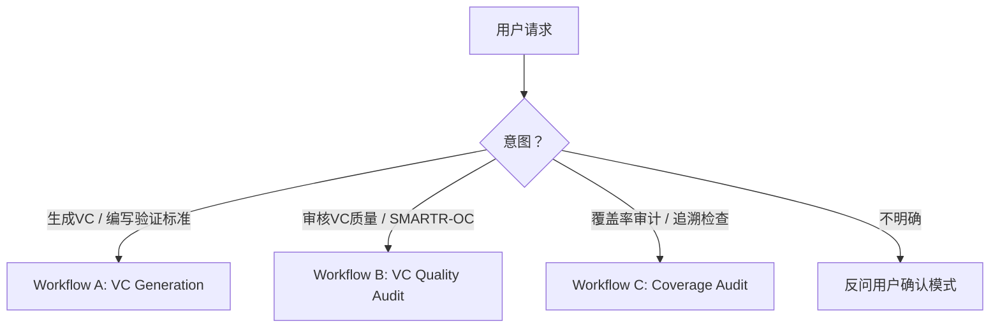

# Verification Criteria Generator & Auditor

Generate, audit, and trace VCs for functional system requirements. ASPICE SYS.2 BP5 / ISO/IEC 29148 / VC-First.

## Mode Selection

**模式判定规则（按关键词匹配，优先级从高到低）**：

| 用户说的关键词 | → 模式 | 理由 |
|---------------|--------|------|
| "生成"/"编写"/"创建" + VC/验证标准 | A | 明确是创建新内容 |
| "审核"/"评审"/"检查质量"/"SMARTR-OC"/"评分" | B | 明确是质量评估 |
| "覆盖率"/"追溯"/"traceability"/"覆盖矩阵"/"遗漏" | C | 明确是覆盖性审计 |
| "review" + "VC"（无"生成"/"创建"） | B | review 在 VC 语境下默认指质量审核 |
| "review" + "覆盖率"/"traceability" | C | 上下文指向覆盖性 |
| 混合意图（如"生成并检查覆盖率"） | 🔴 ASK | 先 A 后 C，用 `vscode_askQuestions` 确认执行顺序 |

Never assume the user's intent. If ambiguous, use `vscode_askQuestions` with this exact format:

> **Header**: "vc-mode-selection"
> **Question**: "I need to confirm what you'd like me to do. Which mode should I use?"
> **Options**:
> - **A — 生成 VC**: 从需求文档生成新的验证标准
> - **B — 审核 VC 质量**: 对已有 VC 做 SMARTR-OC 评分和 CK 检查
> - **C — 覆盖率审计**: 检查 VC 对需求的覆盖完整性

🔴 **CHECKPOINT · 🛑 STOP** — 模式确认后，暂停向用户复述所选模式及下一步操作，等用户说"继续"/"OK"后再加载对应 workflow 文件。**绝不自行跳转模式。**

## VC-First Methodology

**Core Principle**: Write the VC simultaneously with every requirement, not after. VC is the requirement's "other half" — the requirement says "what"; the VC says "how we prove it."

> "Every requirement is a hypothesis awaiting verification. If you can't write a VC, the requirement isn't ready."

> See `references/vc-anti-patterns.md` for common VC-First mistakes and corrective examples.

### Requirement Maturity Gate

When a VC **cannot** be written for a requirement, the requirement is immature. Flag it:

- 🔴 **VC-BLOCKED**: No VC can be defined at all → **Rewrite the requirement**
- 🟡 **VC-PARTIAL**: VC exists but only covers normal conditions → Add boundary (-40°C/+85°C) and abnormal (fault, overvoltage) scenarios
- 🟠 **VC-ASSUMPTION**: VC depends on unconfirmed assumptions → Document the assumption explicitly, escalate; write provisional VC

**Escalation rule**: If ≥3 requirements in a review session are flagged VC-BLOCKED, stop and reassess the requirements baseline.

🔴 **CHECKPOINT · 🛑 STOP** — 若触发升级规则（≥3 VC-BLOCKED），暂停所有 VC 工作，向用户报告问题需求清单，等用户决定"修订需求后继续"或"终止本次会话"后再行动。

## Workflows

Determine mode from the flowchart above.

### ⚡ MANDATORY: Create Todo List Before Starting

**Before executing any workflow step**, you MUST call `manage_todo_list` to create a todo list. Each workflow file defines its own todo items — copy them from the workflow file's "## Todo List Template" section. Mark each item `in-progress` before starting it and `completed` immediately after.

> **Why**: The todo list gives the user real-time visibility into progress, ensures no steps are skipped, and makes the workflow resumable across long sessions. A workflow without a todo list is a protocol violation.

| Mode | Workflow | Load | Input | Output |
|------|----------|------|-------|--------|
| A — Generate VC | VC Generation (A.0~A.4) | `references/vc-workflow-a.md` | 需求文档（md/xlsx/csv） | VC 表 + Source Depth 标注 + 覆盖率报告 |
| B — Audit VC Quality | SMARTR-OC + CK-01~CK-10 Audit (B.0~B.4) | `references/vc-workflow-b.md` | VC 文档（md/xlsx/csv） | SMARTR-OC 评分表 + CK 清单 + 质量审核报告 |
| C — Audit Coverage | Coverage completeness & orphan detection (C.0~C.5) | `references/vc-workflow-c.md` | 需求文档 + VC 文档（可同文件） | 覆盖率矩阵 + UNCOVERED/ORPHAN 清单 + 审计报告 |

**Workflow 步骤速览**（详细步骤见各 workflow 文件）：

- **A (VC Generation)**: A.0 解析需求 → A.1 分类需求类型 → A.2 逐条生成VC（5-element + Source Depth）→ A.3 SMARTR-OC 自检（≥6/8）→ A.4 覆盖率审计，回退补齐遗漏
- **B (VC Quality Audit)**: B.0 解析VC文档 → B.1 分类VC类型 → B.2 SMARTR-OC 八维评分 + CK-01~CK-10 checklist → B.3 汇总 disposition（Pass/Revise/Blocked）→ B.4 输出质量审核报告
- **C (Coverage Audit)**: C.0 建立需求+VC ID索引 → C.1 正向追溯（需求→VC）→ C.2 反向追溯（VC→需求）→ C.3 孤儿VC检测 → C.4 重复覆盖检测 → C.5 输出覆盖率矩阵 + 审计报告

🔴 **CHECKPOINT · 🛑 STOP** — 加载 workflow 文件后、执行第一步之前，向用户展示 todo list，确认后再开始执行。

## 并行子Agent调度 (Parallel Dispatch)

Workflow A 且需求数量 > 50 → 自动启用并行子Agent模式。

### 触发条件
- 需求总数 > 50
- 仅 Workflow A (VC Generation) 支持；Workflow B/C 不走并行

### 拆分策略
按功能域拆分，每个子Agent处理完整的功能域：
- 每个子Agent ≤ 30 条需求
- 功能域不跨Agent拆分（保持上下文完整性）
- 子Agent数 = 功能域按 30 条/Agent 合并，通常 3~5 个

### 主Agent职责

- **分派**: 读取需求文档 → 按功能域拆分 → 并行启动子Agent
- **合并**: 收集所有子Agent输出 → 拼接为完整 VC 文档
- **分层复核** (SMARTR-OC):
  - 8/8 → 信任（低风险，错判仍是 ≥6/8）
  - 6-7/8 → 随机抽样 20%，1 条不一致则扩至全量
  - <6/8 → 全量复核（高风险，决定需求是否重写）
  - 异常检测: 任一子Agent均分偏离全局 >1.0 → 全量复核该Agent
- **覆盖率审计 (A.4)**: 主Agent独立执行
- **CHECKPOINT 展示**: 合并后一次性展示批量结果（不逐条打断）

### 子Agent Prompt 结构

每个子Agent接收自包含 prompt，内联 + 按需读取混合：

**📋 内联（必须，~2K tokens）**:
- 需求子集（完整原文 + 交叉引用速查）
- 领域上下文（BMS/汽车惯例等）
- 🔴 Hard Gates 卡（10 条，见 `references/vc-hard-gates.md`）
- 输出格式规范（编号/路径/AssumptionLog）
- 行为约束（禁止等待用户确认、VC-BLOCKED 处理）

**📁 按需读取（传路径，子Agent自行 `read_file`）**:
- `references/vc-smartr-oc.md` — 始终需要
- `references/vc-source-depth.md` — 始终需要
- `assets/vc-template.md` — 始终需要
- `references/vc-safety-patterns.md` — 仅 ASIL 需求
- `references/vc-sequence-guide.md` — 仅多场景需求
- `references/vc-exceptions.md` — 仅遇异常时

### 子Agent失败处理
- 单个子Agent失败 → 重试 1 次（相同 prompt）
- 仍失败 → 主Agent降级为顺序处理该子批次
- ≥2 个子Agent失败 → 终止并行，全局降级为顺序模式
- 详见 `references/vc-exceptions.md`

## 异常与边界条件

核心原则：异常先告知用户，再按规则处理；绝不静默跳过或静默失败。

### 关键 Fallback 规则（内联）

以下为最常见异常的即时处理规则。完整 13 条规则见 `references/vc-exceptions.md`。

| 触发条件 | 严重度 | 处理动作 | 仍失败则 |
|---------|--------|---------|---------|
| 需求文档无法解析（非 md/xlsx/csv，或结构混乱） | 🔴 | 向用户报告具体问题行/字段，请求提供结构化格式；**不静默跳过，不自行猜测** | 终止当前 Workflow，等用户提供有效输入 |
| SMARTR-OC 连续 3 次修订仍 < 6/8 | 🔴 | 标记该需求为 VC-BLOCKED，记录阻塞原因，继续下一条；**不无限循环** | 累计 ≥3 VC-BLOCKED → 触发升级规则，暂停全部 VC 工作 |
| 覆盖率审计 ≥3 轮回退仍有 UNCOVERED | 🔴 | 暂停，展示未覆盖需求清单 + 阻塞原因；用 `vscode_askQuestions` 让用户决定：接受部分覆盖 / 修订需求 / 终止 | 用户不回复 → 采用"接受部分覆盖"，标注 ⚠️ |
| 用户发出混合模式指令（≥2 Workflow 同时触发） | 🔴 | 用 `vscode_askQuestions` 确认执行顺序（默认先 A 后 C），不自行决定 | 用户不回复 → 按默认顺序执行，明确告知 |
| ≥2 个子Agent同时失败（空输出/超时/异常） | 🔴 | 终止并行模式，报告失败子批次+原因，全局降级为顺序模式 | 顺序模式也失败 → 标记批次为 error，继续下一批 |
| 引用文件缺失（`references/` 或 `assets/` 文件不存在） | 🟡 | 报告缺失文件清单，用内置知识降级处理，标注 `⚠️ degraded: 缺少 {filename}`；不中断整体流程 | 关键文件缺失（如 workflow 文件）→ 终止当前模式，建议用户检查安装 |
| 输入文件过大（>200 条需求顺序模式） | 🟡 | 提示用户总量，建议分批（≤50 条/批）；>50 条自动触发并行子Agent模式 | 用户坚持全量 → 顺序执行，每 50 条暂停确认 |
| `vscode_askQuestions` 无响应（超时/工具失败） | 🟡 | 采用默认安全选项（优先"增量补充"而非"覆盖"，优先"仅评估"而非"自动修改"），明确告知用户所采用的默认值及后果 | — |
| 用户中途要求切换模式 | 🟡 | 保存当前进度（列出已完成 VC ID 清单），切换后告知用户可从中断点继续；不丢失已完成工作 | — |
| 输出目录不存在 | 🟡 | 自动创建目录（`create_directory`），告知用户 | — |

## Key Principles

- **VC-First**: VC is written with every requirement, not after. If you can't write a VC, the requirement isn't mature enough.
- **VC is a design activity**, not a documentation task.
- **VC ownership**: Requirements engineer writes VC; test engineer reviews for testability.
- **One VC = one independently verifiable aspect** — don't merge unrelated checks.
- **Source Depth — No Unsourced Content**: Every numeric value in a VC must carry a source tag (`[R]`/`[D]`/`[S]`/`[E]`/`[A]`). Full annotation rules in `references/vc-source-depth.md`.
  - Hard Gate: ≥3 `[A]` in one VC → VC-BLOCKED → revise the requirement.
  - Any `[A]` → SMARTR-OC A (Achievable) = ✗ automatically.

🔴 **CHECKPOINT** — 每条 VC 生成后：向用户展示该 VC 及其 SMARTR-OC 自检结果。若用户不满意，当场修订后再继续。

🔴 **CHECKPOINT** — Workflow 最终输出前：展示完整 VC 文档 + 覆盖率报告摘要，等用户确认后再输出最终文件。

## References

Load on demand — only when the corresponding workflow step is reached. Verify file exists before loading; if missing, fall back per `references/vc-exceptions.md` "引用文件缺失".

- `references/vc-workflow-a.md` — Workflow A selected
- `references/vc-workflow-b.md` — Workflow B selected
- `references/vc-workflow-c.md` — Workflow C selected
- `references/vc-smartr-oc.md` — **A.3 / B.2**: SMARTR-OC 8-point scoring rubric
- `references/vc-source-depth.md` — **A.2a / B.2**: Source Depth 5-level annotation
- `assets/vc-template.md` — **A.2**: VC table template + 4 type-specific templates
- `references/vc-safety-patterns.md` — **A.2**: ASIL requirements → safety margins, Double-100, test matrix
- `assets/vc-checklist.md` — **B.2**: SMARTR-OC scoring form + CK-01~CK-10 checklist
- `references/vc-report-templates.md` — **A.4 / B.4 / C.5**: report templates
- `references/vc-handbook.md` — Deep-dive on 5-element structure, Top 10 pitfalls
- `references/vc-framework.md` — VC-First theory, SMARTR-OC rationale
- `references/vc-anti-patterns.md` — VC examples, suspicious VC diagnosis
- `references/vc-sequence-guide.md` — **A.2**: Multi-scenario/causal-chain Sequence constraints
- `references/vc-exceptions.md` — Exception handling fallback rules
- `references/vc-hard-gates.md` — **Parallel Dispatch**: 10 Hard Gates card inlined into subAgent prompts

## ⛔ Do Not — 反例黑名单

以下反模式在执行任何 workflow 时**一律禁止**。遇到即标记为错误，必须修正。

| # | 反模式 | 为什么禁止 | 替代做法 |
|---|--------|-----------|---------|
| 1 | **把需求原文复述为 VC** | 零信息增量，无法指导测试 | VC 必须比需求更具体：加上方法、条件、数值判据 |
| 2 | **VC 中引用 Test Case 编号**（"详见 TC-001"） | 循环引用——VC 是 TC 的上游输入 | 在 VC 中直接写明方法/条件/判据 |
| 3 | **使用主观形容词**（"良好"/"合理"/"足够"/"正常"/"快速"/"稳定"/robust/sufficient/adequate） | 无法客观判定 pass/fail | 必须用 `≤/≥/=` + 数值 + 单位 |
| 4 | **跳过覆盖率审计直接结束**（A.4 不执行） | 遗漏未覆盖需求，ASPICE 不合格 | 每次生成 VC 后必须跑 A.4，直到 100% 覆盖 |
| 5 | **所有 VC 统一用 "Test" 方法** | 不同需求类型需不同验证方法 | 用决策树选择：物理测量→Test；理论推导→Analysis；文档/布局→Inspection；操作演示→Demonstration |
| 6 | **编造无来源的数值**（凭感觉写阈值/样本量/温度） | 看似专业实则不可验证 | 每个数值标注 `[R]/[D]/[S]/[E]/[A]` 来源（见 `references/vc-source-depth.md`） |
| 7 | **只在常温(25°C)测试** | 边界和异常条件是失效高发区 | 至少覆盖：常温 + 需求工作域下限 + 上限（如 -40°C/+85°C） |
| 8 | **静默跳过异常或错误** | 破坏流程完整性，用户无法察觉 | 遇到异常必须向用户报告，按 fallback 规则处理 |
| 9 | **跳过 SMARTR-OC 自检直接输出** | 质量无保障，可能产出不可测试的 VC | 每条 VC 必须 SMARTR-OC ≥ 6/8 才能进入下一步 |

> 完整反例库见 `references/vc-anti-patterns.md`。本表为主文件必看的最小集。