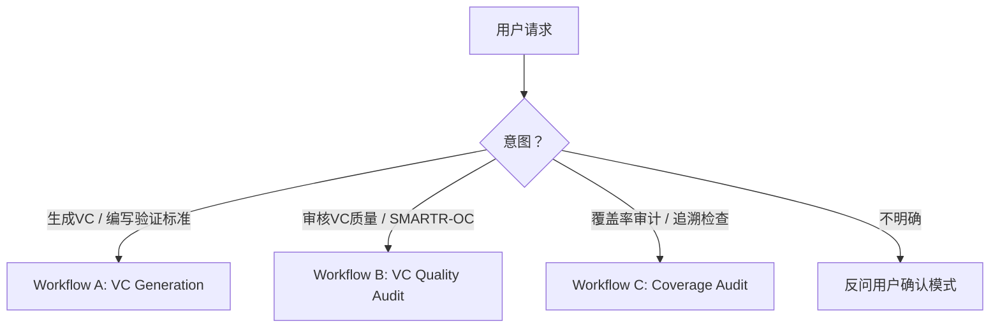

# Verification Criteria Generator & Auditor

Generate, review, and audit verification criteria (VC) for functional system requirements. Follows ASPICE SYS.2 BP5, ISO/IEC 29148, and VC-First methodology.

## Mode Selection

Never assume the user's intent. "review my VCs" → Mode B, not A. If ambiguous, use `vscode_askQuestions` to confirm which mode: "Which would you like me to do — generate new VCs, audit existing VC quality, or audit VC coverage?"

## VC-First Methodology

**Core Principle**: Write the VC simultaneously with every requirement, not after. VC is the requirement's "other half" — the requirement says "what"; the VC says "how we prove it."

> "Every requirement is a hypothesis awaiting verification. If you can't write a VC, the requirement isn't ready."

> See `references/vc-anti-patterns.md` for common VC-First mistakes and corrective examples.

### Requirement Maturity Gate

When a VC **cannot** be written for a requirement, the requirement is immature. Flag it:

- 🔴 **VC-BLOCKED**: No VC can be defined at all → **Rewrite the requirement**
- 🟡 **VC-PARTIAL**: VC exists but only covers normal conditions → Add boundary (-40°C/+85°C) and abnormal (fault, overvoltage) scenarios
- 🟠 **VC-ASSUMPTION**: VC depends on unconfirmed assumptions → Document the assumption explicitly, escalate; write provisional VC

**Escalation rule**: If ≥3 requirements in a review session are flagged VC-BLOCKED, stop and reassess the requirements baseline.

## Workflows

Determine mode from the flowchart above.

### ⚡ MANDATORY: Create Todo List Before Starting

**Before executing any workflow step**, you MUST call `manage_todo_list` to create a todo list. Each workflow file defines its own todo items — copy them from the workflow file's "## Todo List Template" section. Mark each item `in-progress` before starting it and `completed` immediately after.

> **Why**: The todo list gives the user real-time visibility into progress, ensures no steps are skipped, and makes the workflow resumable across long sessions. A workflow without a todo list is a protocol violation.

| Mode | Workflow | Load |
|------|----------|------|
| A — Generate VC | VC Generation (A.0~A.4) | `references/vc-workflow-a.md` |
| B — Audit VC Quality | SMARTR-OC + CK-01~CK-10 Audit (B.0~B.4) | `references/vc-workflow-b.md` |
| C — Audit Coverage | Coverage completeness & orphan detection (C.0~C.5) | `references/vc-workflow-c.md` |

## Key Principles

1. **VC-First**: VC is written simultaneously with requirements, not after
2. **VC is a design activity**, not a documentation task
3. **If you can't write a VC, the requirement isn't mature enough** — flag it
4. **VC ownership**: Requirements engineer writes VC; test engineer reviews for testability
5. **One VC verifies one independently verifiable aspect** — don't merge unrelated checks
6. **Source Depth — No Unsourced Content**: Every value in a VC (thresholds, sample sizes, environment ranges, fault types, equipment precision) must be traceable to one of five source depths. See `references/vc-source-depth.md` for the full annotation system.
   - `[R]` **Requirement-text**: value appears verbatim in the requirement
   - `[D]` **Derived**: logically derived from the requirement (e.g. "全生命周期" → BOL/MOL/EOL)
   - `[S]` **Standard**: cited from a named standard, regulation, or upstream specification
   - `[E]` **Engineering judgment**: domain convention (e.g. automotive three-temperature -40/+25/+85°C, N=20 for functional tests)
   - `[A]` **Assumption / unknown**: value is unconfirmed — **MUST** document the assumption; this flag triggers an automatic `A = ✗` in SMARTR-OC scoring
   - 🔴 **Hard Gate**: If ≥3 values in a single VC carry `[A]`, that VC is VC-BLOCKED and the requirement must be revised before the VC can proceed.

## References

Load on demand — only when the corresponding workflow step is reached.

| File | When to Load |
|------|-------------|
| `references/vc-workflow-a.md` | Workflow A selected (mode confirmed) |
| `references/vc-workflow-b.md` | Workflow B selected (mode confirmed) |
| `references/vc-workflow-c.md` | Workflow C selected (mode confirmed) |
| `references/vc-smartr-oc.md` | **A.3 / B.2**: SMARTR-OC 8-point scoring rubric with operational checklist |
| `references/vc-source-depth.md` | **A.2a / B.2**: Source Depth 5-level annotation system + threshold provenance check |
| `assets/vc-template.md` | **A.2**: VC table template + 4 type-specific structured templates (functional, performance, safety, interface) |
| `references/vc-safety-patterns.md` | **A.2**: requirement has ASIL level — safety margin rules, double-100 verification, test coverage matrix |
| `assets/vc-checklist.md` | **B.2**: printable SMARTR-OC scoring form + peer review checklist (CK-01~CK-10) |
| `references/vc-report-templates.md` | **A.4 / B.4 / C.5**: quality audit or coverage audit report templates |
| `references/vc-handbook.md` | Deep-dive on 5-element structure, Top 10 pitfalls, or peer review checklist details |
| `references/vc-framework.md` | User asks about VC-First methodology theory, SMARTR-OC model rationale |
| `references/vc-anti-patterns.md` | User asks for VC examples, or a generated VC looks suspicious |
| `references/vc-sequence-guide.md` | **A.2**: VC involves multi-scenario / causal-chain / baseline recovery — 4-question decision framework for Sequence constraints |