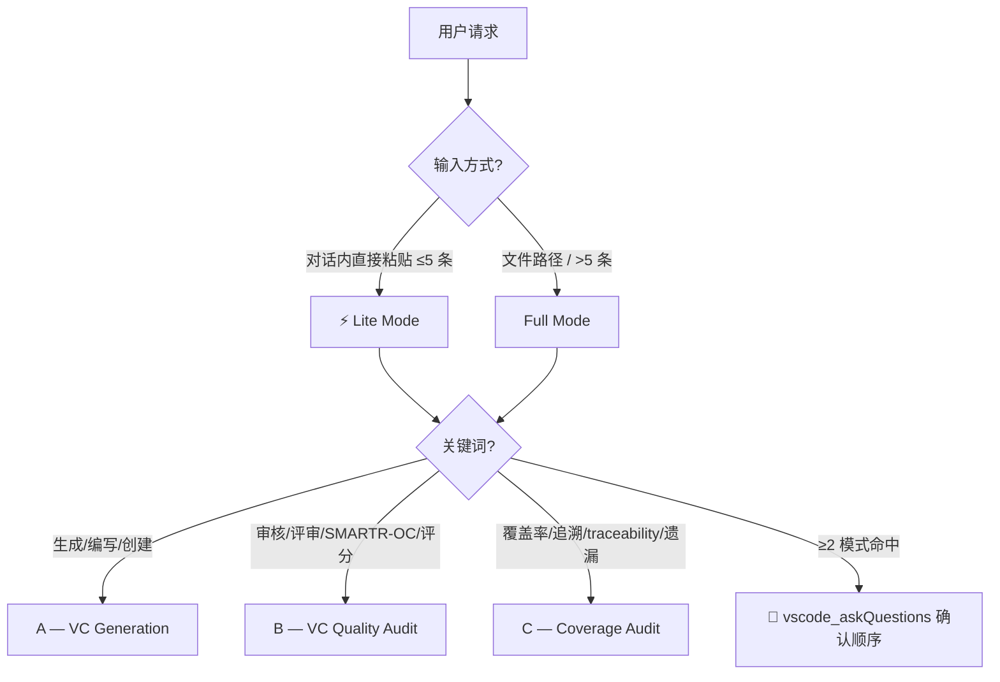

# Verification Criteria Generator & Auditor

Generate, audit, and trace VCs for functional system requirements. ASPICE SYS.2 BP5 / ISO/IEC 29148 / VC-First.

## Route — 3 步定模式（入口）

### Step 1 — Lite vs Full

| 判定 | Lite Mode（跳过 CHECKPOINT） | Full Mode（强制 CHECKPOINT） |
|------|------------------------------|------------------------------|
| 输入 | 对话内直接粘贴文本 | 文件路径 / 文件引用 |
| 数量 | ≤5 | >5 |
| 跳过项 | 源确认 / Todo List / 中间展示 / 最终确认 | 无 |
| 不降级 | 质量门控（SMARTR-OC / Source Depth / 反例扫描 / 覆盖率）全部强制执行 |

### Step 2 — 关键词定模式（唯一模式命中 → 跳过模式确认，合并到源确认）

| 关键词 | → 模式 |
|--------|--------|
| "生成"/"编写"/"创建" + VC | A |
| "审核"/"评审"/"SMARTR-OC"/"评分"/"review"+VC | B |
| "覆盖率"/"追溯"/"traceability"/"遗漏" | C |
| ≥2 模式同时命中 | 🔴 `vscode_askQuestions`（Header `vc-mode-selection`，确认执行顺序） |

**⚠️ 强制 `vscode_askQuestions`**：Never assume intent. 需要确认模式/等待决策时**必须**调用工具，而非输出文字等待手动回复（反例 #11）。

### Step 3 — Todo List + 源文档确认（Full Mode 强制；Lite 跳过）

Full Mode 加载对应 workflow 文件后，**立即** `manage_todo_list`（从 workflow 文件的 "## Todo List Template" 复制）。无 todo list = 协议违规。然后用 `vscode_askQuestions` 一次性确认模式 + 源文档 + Todo List（Token 优化：三合一，不单独发轮）。

🔴 **CHECKPOINT · 🛑 STOP** — 必须在源文档确认中明确告知当前模式。**绝不静默跳转模式。绝不输出执行流程概要**（反例 #10）。

---

## Mode A — VC Generation（加载 `references/vc-workflow-a.md`）

> ⚡ **一句话**：为每条需求生成可独立验证的测试标准（方法+条件+数值判据+来源标注）

**触发**："生成"/"编写"/"创建" VC | **输入**：需求文档（md/xlsx/csv） | **输出**：VC 表 + Source Depth 标注 + 覆盖率报告

| 步骤 | 动作 | 失败处理 |
|------|------|---------|
| A.0 确认需求文档 | 扫描已有VC；发现已有→`vscode_askQuestions`询问增量/覆盖/切换 | 无源/格式错误→🛑 |
| A.1 解析需求 | 提取ID/描述/约束/功能域；按类型分类 | >50条→并行Agent；>200条→分批 |
| **A.1a 拆分需求文件** | **（仅 >50条）** 运行 `scripts/split_req.py` 按功能域拆分→核对ID完整性→构造分派映射 | 拆分不一致→🛑 |
| A.2 逐条生成VC | 匹配验证方法(决策树)→填写5元素（加载`vc-template.md`） | 统一"Test"→反例#5 |
| A.2a Source Depth | 逐值标注`[R]/[D]/[S]/[E]/[A]`（加载`vc-source-depth.md`） | ≥3[A]→🔴VC-BLOCKED |
| A.3 SMARTR-OC自检 | 8维评分（加载`vc-smartr-oc.md`） | <6/8→修订≤3次→仍不合格→VC-BLOCKED |
| A.4 覆盖率审计 | 正向+反向追溯+孤儿检测 | 必须100%；≥3轮仍UNCOVERED→🛑 |

**VC-First 7步循环**（每条需求）：理解意图 → 选择方法 → 定义标准 → Source Depth 标注 → 设定条件 → 编写VC → SMARTR-OC 自检

**验证方法决策树**（A.2 步，按需求类型自动匹配 — 红线：全用 "Test" 违反反例#5）：

| 需求类型 | 识别特征 | 验证方法 | 典型示例 |
|---------|---------|---------|---------|
| 物理量 | 可量化测量值（电压/电流/温度/绝缘电阻） | **Test** — 校准设备实测 | 电压精度 ≤±0.5%FSR、绝缘 ≥100MΩ |
| 逻辑/算法 | 计算/判断/状态转换 | **Analysis** — 理论推导+边界值注入 | SOC 估算精度 ≤5% |
| 安全/保护 | 故障响应时间、安全状态进入 | **Test + Analysis** — 故障注入+时序测量+安全分析 | 过压 100ms 内断继电器 |
| 时序 | 时间约束 ≤ X ms | **Test** — 示波器/逻辑分析仪计时 | 上电自检 ≤5s |
| 操作/功能 | 人机交互/功能流程 | **Demonstration** — 操作演练+功能走查 | HMI 显示正确性 |
| 文档/布局 | 设计输出物/物理布置 | **Inspection** — 审查/尺寸测量/目视 | 丝印可读性、爬电距离 |

---

## Mode B — VC Quality Audit（加载 `references/vc-workflow-b.md`）

> ⚡ **一句话**：对已有 VC 做 SMARTR-OC 8维评分 + CK-01~CK-10 清单，给 Pass/Revise/Blocked 处置

**触发**："审核"/"SMARTR-OC"/"评分" | **输入**：VC 文档（md/xlsx/csv） | **输出**：SMARTR-OC 评分表 + CK 清单 + 质量报告

| 步骤 | 动作 | 失败处理 |
|------|------|---------|
| B.0 确认VC文件 | 读取/解析VC文档 | 无源/格式错误→🛑 |
| B.1 解析VC | 提取VC ID/关联需求/方法/条件/判据 | 缺关联需求→🟠MISSING-LINK |
| B.2 质量审核 | SMARTR-OC 8维+CK-01~10（加载`vc-smartr-oc.md`+`vc-checklist.md`） | <6/8或🔴Critical→需修订 |
| B.3 改进建议 | 逐条修复→重评→循环 | 3轮不达标→VC-BLOCKED |
| B.4 输出报告 | 汇总Pass/Conditional/Revise/Blocked | 模板缺失→降级 |

---

## Mode C — Coverage Audit（加载 `references/vc-workflow-c.md`）

> ⚡ **一句话**：检查需求↔VC双向覆盖完整性，输出 UNCOVERED/ORPHAN 清单 + 覆盖率矩阵

**触发**："覆盖率"/"追溯"/"traceability" | **输入**：需求文档 + VC 文档（可同文件） | **输出**：覆盖率矩阵 + UNCOVERED/ORPHAN 清单

| 步骤 | 动作 | 失败处理 |
|------|------|---------|
| C.0 确认来源 | `vscode_askQuestions`确认需求+VC双源 | 缺任一→🛑 |
| C.1 解析ID | 提取需求ID+VC关联ID | ID不统一→报告差异 |
| C.2 完整性检查 | 每条需求≥1VC | 零VC→🔴UNCOVERED；>30%→暂停C补A |
| C.3 孤儿检测 | 每条VC关联已存在需求 | 不存在→🔴ORPHAN；>20%→修正ID |
| C.4 覆盖率矩阵 | 构建需求↔VC追溯矩阵 | — |
| C.5 输出报告 | 覆盖率%+未覆盖清单+建议 | 模板缺失→降级 |

---

## Parallel Dispatch（仅 Mode A，需求 > 50）

> **先用 `scripts/split_req.py` 按功能域拆分为独立 `.md` 文件**（≤30条/文件，域不跨文件），再并行 `runSubagent`，每个子Agent prompt **只传 `{requirements_file_path}`**（不内联全文），子Agent自行 `read_file` 加载。

| 要素 | 规则 | 详见 |
|------|------|------|
| 触发 | 需求 > 50，仅 Mode A | — |
| 拆分 | `scripts/split_req.py` → ≤30条/文件，产出 `_index.json` | `references/vc-workflow-a.md §A.1a` |
| 分派 | 单次并行 ≤5 Agent，超限分轮；每个Agent对应一个拆分文件 | — |
| 调度 | 同时并行 `runSubagent`；prompt 只填 `{requirements_file_path}`；不传 `agentName` | `references/vc-subagent-prompt.md` |
| 合并 | `scripts/merge_vc.py` 自动合并+统计+覆盖率验证→分层复核→A.4 覆盖率→CHECKPOINT | `references/vc-subagent-prompt.md` |
| 失败 | 单失败→重试1次→降级顺序；≥2失败→全局降级 | `references/vc-exceptions.md` |

**分层复核**（SMARTR-OC 抽样审计）：8/8 跳过 / 6-7 抽样 20%（1条不一致→全量）/ <6 全量 / 均分偏离全局 >1.0 全量。

🔴 **CHECKPOINT · 🛑 STOP** — A.1a 拆分完成后、spawn 子Agent前：展示拆分方案（domain + ID 范围 + 条数 + 输出路径），`vscode_askQuestions` 确认后并行执行。禁止跳过。

---

## 共享规则（三模式通用）

### VC-First Methodology

**Core Principle**: Write the VC simultaneously with every requirement. VC is the requirement's "other half" — requirement says "what"; VC says "how we prove it."

> See `references/vc-anti-patterns.md` for common VC-First mistakes and corrective examples.

### Requirement Maturity Gate

| 标记 | 含义 | 动作 |
|------|------|------|
| 🔴 **VC-BLOCKED** | 无法写 VC | 重写需求 |
| 🟡 **VC-PARTIAL** | VC 仅覆盖正常条件 | 补边界(-40°C/+85°C)+异常工况 |
| 🟠 **VC-ASSUMPTION** | VC 依赖未确认假设 | 显式记录假设+升级+写临时 VC |

🔴 **CHECKPOINT · 🛑 STOP** — 累计 ≥3 VC-BLOCKED → 暂停所有 VC 工作，`vscode_askQuestions` 让用户选择"修订需求后继续"或"终止"。

### Key Principles（每条独有的 🔴 GATE）

> 反例详见 [⛔ Do Not 黑名单](#⛔-do-not--反例黑名单)。

- **VC-First** — 🔴 GATE：无法写出 VC → 立即标记 VC-BLOCKED，不继续下一条
- **VC is a design activity** — 🔴 GATE：写 VC 时主动质疑需求可测性，必要时回推修订需求
- **VC ownership** — Requirements engineer 写 VC；test engineer 审 testability
- **One VC = one independently verifiable aspect** — 🔴 GATE：精度/响应时间/覆盖范围各自独立成条
- **Source Depth — No Unsourced Content** — 🔴 GATE：≥3 `[A]` → VC-BLOCKED；Any `[A]` → SMARTR-OC A=✗
- **Engineer-Readable** — 每 VC 字段 10 秒内被陌生工程师理解，无缩写解码

### 批量展示 + 最终输出 CHECKPOINT

🔴 **CHECKPOINT · 🛑 STOP**：
1. ≤10 条需求 → 逐条展示 VC + SMARTR-OC；>10 条 → 每 10 条批量展示，`vscode_askQuestions` 确认后继续
2. A.3 完成后 → 展示 SMARTR-OC 汇总（各维度 ✅/✗ + 总分分布），标注 <6/8 的 VC。用户选择：(a)修订重检 / (b)标记 disposition 继续 A.4 / (c)终止导出
3. 最终输出前 → 展示完整 VC 文档 + 覆盖率摘要，`vscode_askQuestions` 确认后输出

---

## 异常与边界条件

核心原则：异常先告知用户，再按规则处理；**绝不静默跳过或静默失败**（反例 #8）。

### 关键 Fallback（最常触发；完整规则见 `references/vc-exceptions.md`）

| 触发条件 | 严重度 | 处理动作 | 仍失败则 |
|---------|--------|---------|---------|
| 需求文档无法解析（非 md/xlsx/csv，或结构混乱） | 🔴 | 报告具体问题行/字段，请求结构化格式；**不静默跳过，不自行猜测** | 终止 Workflow，等有效输入 |
| SMARTR-OC 连续 3 次修订仍 < 6/8 | 🔴 | 标记 VC-BLOCKED，记录阻塞原因，继续下一条；**不无限循环** | 累计 ≥3 VC-BLOCKED → 升级，暂停全部 |
| 覆盖率审计 ≥3 轮回退仍有 UNCOVERED | 🔴 | 暂停，展示未覆盖清单+阻塞原因；`vscode_askQuestions` 决定：接受部分覆盖/修订/终止 | 不回复 → 接受部分覆盖，标 ⚠️ |
| 混合模式指令（≥2 Workflow） | 🔴 | `vscode_askQuestions` 确认顺序（见下表），不自行决定 | 不回复 → 按默认顺序，明确告知 |
| ≥2 子Agent同时失败（空输出/超时/异常） | 🔴 | 终止并行，报告失败子批次+原因，全局降级顺序 | 顺序也失败 → 标 error，继续下一批 |

### 混合模式执行顺序与交叉联动

| 混合模式 | 默认顺序 | 交叉联动 |
|---------|---------|---------|
| A + C | 先 A 后 C | A.4 完成后 C.0~C.5 复用 A 输出（A→C 复用快速通道见下） |
| B + C | 先 B 后 C | B.3 disposition 后，未 Pass 的 VC **暂不计入 C 覆盖率**（避免虚高） |
| A + B | 先 A 后 B | — |
| A + B + C | A → B → C | 同上联动 |

**交叉发现联动**（后 Workflow 发现的问题反馈到前 Workflow）：
- C.3 发现 ORPHAN VC → B.2 报告标注 `⚠️ cross-flagged: ORPHAN，质量评分降权`
- C.2 发现 UNCOVERED → 提示回退 A.2 补齐
- B.2 发现 VC-BLOCKED → C 覆盖率矩阵标注 `⚠️ VC-BLOCKED，覆盖率待定`

**A→C 复用快速通道**（A+C 混合，A.4 完成后进入 C）：跳过 C.0/C.1 → C.2 用 A.4 矩阵增量检查 → C.3 扫 A 输出标 ORPHAN → C.4 基于 A.4 加 disposition 列 → C.5 输出报告。

### Lite Mode 信息不完整处理

- 缺工作温度范围 → 常温 + `⚠️ 需求未指定温度边界，仅按常温(25°C)验证` → 🟡 VC-PARTIAL
- 缺故障条件 → 正常工况 + `⚠️ 未覆盖故障/异常工况` → 🟡 VC-PARTIAL
- 数值无来源 → `[A: Lite Mode推断，需确认]` + 提示补充 → 🟠 VC-ASSUMPTION
- 主观形容词（良好/快速/稳定） → 🔴 VC-BLOCKED，建议量化 → 🔴 VC-BLOCKED

> 累积 ≥3 🟡/🟠 → 不触发升级（与 ≥3 🔴 VC-BLOCKED 不同）。但需在输出摘要标注信息缺口。

**Lite Mode VC-BLOCKED 定义**（与 Full Mode B.3 区别）：无 B.3 改进循环 → 首次 SMARTR-OC < 6/8 即直接判 BLOCKED（不重试）。仅 🔴 级（反例#3 主观词 / 反例#6 全 `[A]` / SMARTR-OC M=✗）触发。🟡/🟠 不作为 BLOCKED，仅质量标记注明。

**触发升级**：Lite Mode 发现 ≥3 VC-BLOCKED 或覆盖率 <100% → 暂停，提示切换 Full Mode。

---

## References（按需加载）

加载对应 workflow 步骤前验证文件存在；缺失按 `references/vc-exceptions.md` "引用文件缺失" fallback。

| Reference | 何时加载 |
|-----------|---------|
| `references/vc-workflow-a.md` / `-b.md` / `-c.md` | 对应模式选中 |
| `references/vc-smartr-oc.md` | **A.3 / B.2** — SMARTR-OC 8维评分 |
| `references/vc-source-depth.md` | **A.2a / B.2** — Source Depth 5级标注（含 `[D]`/`[A]` 判定表） |
| `assets/vc-template.md` | **A.2** — VC 表模板 + 4 类型模板 |
| `references/vc-safety-patterns.md` | **A.2** — ASIL → 安全裕度、Double-100、测试矩阵 |
| `assets/vc-checklist.md` | **B.2** — SMARTR-OC 评分表 + CK-01~CK-10 |
| `references/vc-report-templates.md` | **A.4 / B.4 / C.5** — 报告模板 |
| `references/vc-framework.md` | VC-First 理论、SMARTR-OC 原理 |
| `references/vc-anti-patterns.md` | VC 反例、可疑 VC 诊断 |
| `references/vc-sequence-guide.md` | **A.2** — 多场景/因果链 Sequence 约束 |
| `references/vc-exceptions.md` | 异常处理 fallback 规则 |
| `references/vc-hard-gates.md` | **Parallel Dispatch** — 11 Hard Gates 内联到子Agent prompt |
| `references/vc-subagent-prompt.md` | **Parallel Dispatch** — runSubagent prompt 模板（只传 `{requirements_file_path}`） |
| `scripts/split_req.py` | **A.1a** — 按功能域拆分需求文件（≤30条/文件，产出 `_index.json`） |
| `scripts/merge_vc.py` | **Parallel Dispatch → Merge** — 合并子Agent输出+SMARTR-OC统计+覆盖率验证+分层复核建议 |

---

## ⛔ Do Not — 反例黑名单

执行任何 workflow 时**一律禁止**。遇到即标记错误，必须修正。

| # | 反模式 | 为什么禁止 | 替代做法 |
|---|--------|-----------|---------|
| 1 | **把需求原文复述为 VC** | 零信息增量，无法指导测试 | VC 必须比需求更具体：加方法、条件、数值判据 |
| 2 | **VC 中引用 Test Case 编号**（"详见 TC-001"） | 循环引用——VC 是 TC 的上游输入 | VC 中直接写明方法/条件/判据 |
| 3 | **使用主观形容词**（"良好"/"合理"/"足够"/"正常"/"快速"/"稳定"/robust/sufficient/adequate） | 无法客观判定 pass/fail | 必须用 `≤/≥/=` + 数值 + 单位 |
| 4 | **跳过覆盖率审计直接结束**（A.4 不执行） | 遗漏未覆盖需求，ASPICE 不合格 | 每次生成 VC 后必须跑 A.4，直到 100% 覆盖 |
| 5 | **所有 VC 统一用 "Test" 方法** | 不同需求类型需不同验证方法 | 决策树：物理量→Test；理论推导→Analysis；文档/布局→Inspection；操作→Demonstration |
| 6 | **编造无来源的数值**（凭感觉写阈值/样本量/温度） | 看似专业实则不可验证 | 每个数值标注 `[R]/[D]/[S]/[E]/[A]`（见 `references/vc-source-depth.md`） |
| 7 | **只在常温(25°C)测试** | 边界和异常条件是失效高发区 | 至少覆盖：常温 + 工作域下限 + 上限（如 -40°C/+85°C） |
| 8 | **静默跳过异常或错误** | 破坏流程完整性，用户无法察觉 | 遇异常必须报告，按 fallback 规则处理 |
| 9 | **跳过 SMARTR-OC 自检直接输出** | 质量无保障，可能产出不可测试的 VC | 每条 VC 必须 SMARTR-OC ≥ 6/8 才能进入下一步 |
| 10 | **输出"执行流程概要"或冗余流程描述**（CHECKPOINT 处长篇复述 workflow） | 零信息增量，浪费 token | CHECKPOINT 处只展示 todo list + 关键决策点，`vscode_askQuestions` 等确认 |
| 11 | **用文字输出等待用户回复**（输出"请回复继续"后 idle） | 依赖用户主动输入，容易遗漏 | 必须调用 `vscode_askQuestions` 提供结构化选项 |

> 完整反例库见 `references/vc-anti-patterns.md`。本表为主文件必看的最小集。
