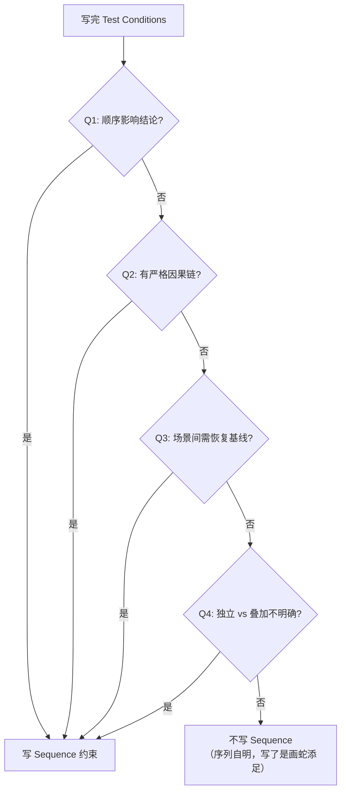

# VC Sequence Constraint Guide

> **加载时机**: Workflow A Step 4（设定测试条件）→ Step 5（编写VC）之间，当 VC 涉及多场景/因果链/基线恢复时加载
> **原则**: Sequence 约束是**可选的**——只在执行顺序影响测试结论时才写。不要对所有 VC 无差别添加。

---

## 4 问决策法

对每条 VC 的 Test Conditions 问自己以下 4 个问题。**任一答 Yes → 需要写 Sequence 约束。**

| # | 问题 | 为什么重要 | 典型触发信号 |
|---|------|-----------|------------|
| **Q1** | 不同执行顺序会导致不同测试结论吗？ | 顺序改变则系统行为改变 → 结论不可复现 | 多场景故障注入、冗余路径切换 |
| **Q2** | 有严格的因果链（A 必须先于 B）吗？ | 因果倒置 → 测到的不是目标行为 | 看门狗级联、安全复位链路 |
| **Q3** | 多场景之间是否需要恢复基线状态？ | 前一场景的副作用污染后一场景 → 假阳性/假阴性 | 故障注入后系统已断电、接触器已断开 |
| **Q4** | 多场景是"并行独立测试"还是"串行叠加测试"？ | 独立 vs 叠加 → 测试设计和判据完全不同 | 热失控多征兆检测（独立触发 vs 同时触发） |

### 决策流程图



---

## Sequence 字段格式

在 Test Conditions 字段中增加一个可选行，使用 `**Sequence**:` 前缀：

```markdown
| VC ID | ... | Test Conditions | ... |
|-------|-----|-----------------|-----|
| VC-XXX-01 | ... | **Rig**: ...; **Temp**: ...; **Precondition**: ...
**Sequence**: ① 建立基线（无故障状态 60s） → ② 注入场景(a) → ③ 验证检出和响应 → ④ 恢复基线 → ⑤ 重复②~④对场景(b)(c)；**Precondition**: ... | ... |
```

### 格式规则

- 使用 `① ② ③` 编号 — 清晰表达顺序，不受 Markdown 有序列表渲染影响
- 使用 `→` 连接步骤 — 表达时序流向
- 关键分支用 `(a)(b)` 标注 — 与 Test Conditions 中场景编号一致
- 恢复点明确标注 — 如 `恢复基线`、`重新上电`、`清除 DTC`
- **不写工具操作** — 不写"打开CAN工具"、"配置HIL参数"（那是Test Case的职责）

---

## 典型场景与示例

### 场景 A：故障注入型 — 需要 Sequence ✅

**特征**: 多故障场景，场景间可能有副作用，独立 vs 叠加不明确。

**示例** — BMS 热失控检测（VC-BMS-030）：

```
❌ 当前 Test Conditions（缺少 Sequence）:
Fault Scenarios: (a) 电压骤降; (b) 温度骤升; (c) 产气触发; (d) a+b+c 同时发生

歧义: (a)(b)(c)(d) 是 4 个独立测试还是 1 个测试的 4 个阶段？
      (d) 之前是否需要先验证 (a)(b)(c) 各自独立有效？

✅ 加上 Sequence:
**Sequence**: 
  ① 建立基线（无故障状态 60s）
  → ② 独立注入场景(a)，验证检出和断电
  → ③ 恢复基线（重新上电，清除故障）
  → ④ 重复②~③对场景(b)(c)
  → ⑤ 独立注入场景(d)，验证检出和断电（不要求先经过(a)(b)(c)）
  → ⑥ (可选) 叠加注入(a)+(b)+(c)，验证不冲突且最终紧急断电
```

触发了 Q1/Q3/Q4。

---

### 场景 B：因果链型 — 需要 Sequence ✅

**特征**: 系统行为是 A→B→C 的因果传播链，每段有时序要求。

**示例** — BMS 双级看门狗（VC-BMS-100）：

```
❌ 如果只写 Test Conditions 不明确顺序:
Test: (a) 停止软件看门狗刷新; (b) 停止硬件看门狗刷新; (c) 无故障刷新

歧义: 同时停两个 WD 测到的是什么？需要先停软件 WD 才能测硬件 WD 的接管行为。

✅ 加上 Sequence:
**Sequence**: 
  ① 建立基线（双 WD 无故障刷新 60s，验证 0 复位）
  → ② 仅停止软件 WD 刷新 → 验证硬件 WD 在 50ms 内检测到
  → ③ 验证系统安全复位 → 接触器在复位后 150ms 内断开
  → ④ 恢复基线（重新上电，双 WD 恢复）
  → ⑤ 仅停止硬件 WD 刷新 → 验证 100ms 内系统复位
  → ⑥ 恢复基线 → 验证无故障刷新 100 次无复位
```

触发了 Q1/Q2。

---

### 场景 C：多级联型 — 需要 Sequence ✅

**特征**: 同一测试会话内，系统需要依次穿越多个阈值，各级响应不同。

**示例** — BMS 三级过温保护（VC-BMS-020）：

```
❌ 当前 Test Conditions 已隐含顺序但不够精确:
逐步升高模拟温度：一级阈值 (55°C) → 二级阈值 (60°C) → 三级阈值 (65°C)

✅ 可以更精确:
**Sequence**: 
  ① 设定起始温度 +40°C（低于所有阈值），建立基线 30s
  → ② 以 1°C/s 速率升温 → 穿越 55°C 时验证 500ms 内功率限至 ≤70%
  → ③ 继续升温 → 穿越 60°C 时验证 500ms 内功率限至 ≤30%
  → ④ 继续升温 → 穿越 65°C 时验证 1s 内断开主回路
  → ⑤ 以 1°C/s 速率降温 → 穿越各阈值时验证解除条件（含迟滞）
```

触发 Q2/Q4。

---

### 场景 D：单步测量型 — 不需要 Sequence ❌

**特征**: 注入→测量→比较，单变量，无分支，无时序依赖。

**示例** — BMS 电压采集精度（VC-BMS-001）：

```
Test Conditions:
Rig: BMS HIL + 可编程电芯电压模拟器; Temp: −40°C, +25°C, +85°C;
对所有通道注入已知参考电压

不需要 Sequence —— "注入→读取→比较"是任何测试工程师的本能反应。
加 Sequence = 画蛇添足。
```

---

### 场景 E：状态机型 — 视情况决定 🟡

**特征**: 系统行为依赖前置状态，但状态切换逻辑本身简单。

**示例** — BMS 均衡使能条件（VC-BMS-033）：

```
Test: (a) 充放电电流 > 1A 时不应启动均衡; (b) SOC=15% 时不应启动均衡; 
      (c) 电流=0, SOC=60% 时均衡按设计启动

这里 (a)(b)(c) 是三个独立条件测试，互不依赖，不需要 Sequence。
但如果需求涉及"从状态A→状态B→状态C的转换路径"，则需要。
```

---

## 反模式

| ❌ 反模式 | 为什么是反模式 | ✅ 正确做法 |
|----------|--------------|-----------|
| 对单步测量型 VC 写 Sequence | 信息噪音，工程师会跳过阅读 | 信任测试工程师的基本专业判断 |
| Sequence 写成操作手册 | 越界到 Test Case 领域 | 只写顺序/分支/恢复点，不写工具操作 |
| "详见测试用例 TC-XXX" | 循环引用——VC 是 TC 的输入 | 在 VC 中明确顺序，TC 引用 VC |
| 每条 VC 都强制加 Sequence | 增加无谓的文档负担 | 用 4 问决策法逐条判断 |
| Sequence 写得比 Test Conditions 还长 | 喧宾夺主 | Sequence 是 Test Conditions 的时序补充，应简洁 |

---

## 与 SMARTR-OC 的关系

Sequence 缺失在 SMARTR-OC 评分中体现为 **R (Repeatable)** 维度扣分：不同测试工程师因执行顺序不同得出不同结论 → ❌。

不新增单独的评分维度或 CK 编号。

---

> **参考**: 本指南配合 `vc-smartr-oc.md` R 维度（Repeatable）使用。  
> **相关**: `vc-anti-patterns.md` 中"VC 颗粒度过粗/过细"一节。
