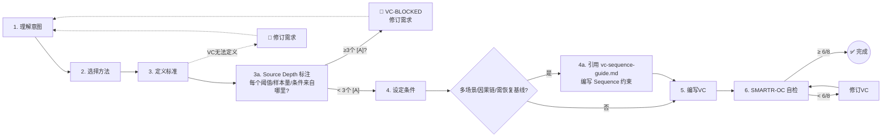
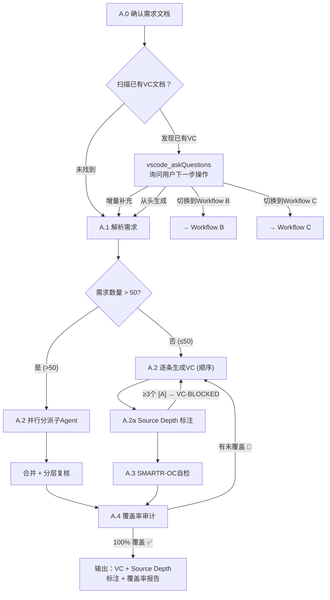
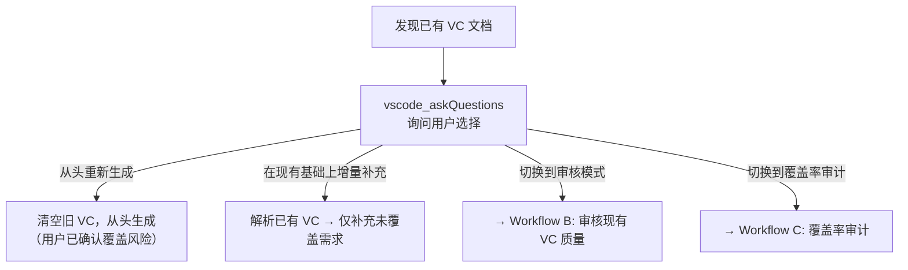
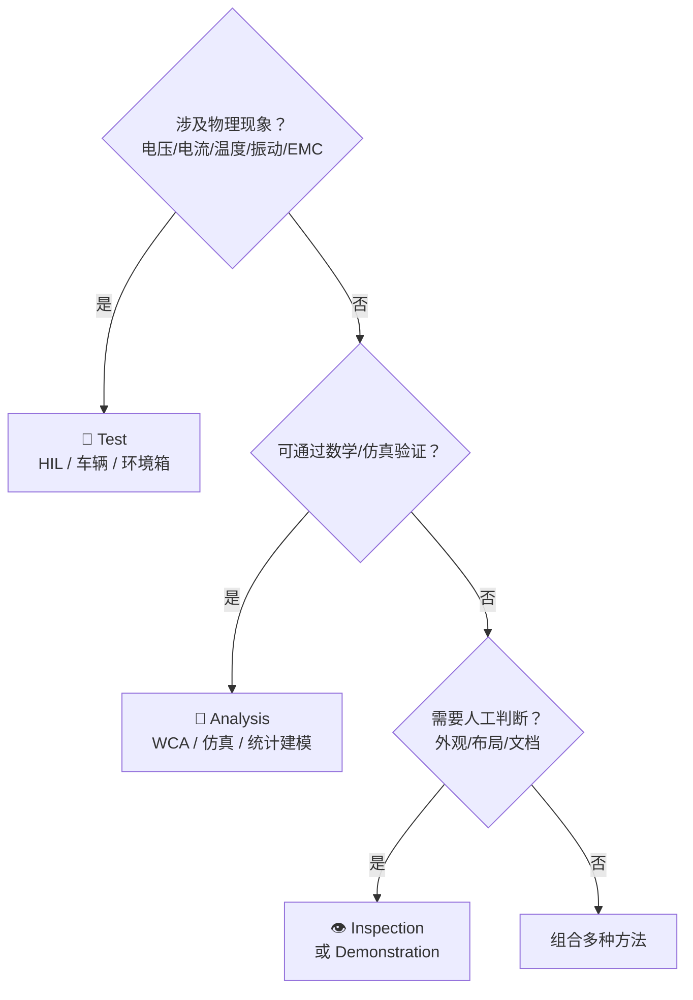

# Workflow A — VC Generation

> Load this file when Workflow A is selected (user wants to **generate** new VCs).
> See `../SKILL.md` for mode selection and VC-First core principles.

Follow VC-First methodology: VC is written simultaneously with each requirement, not after.

## Todo List Template

**IMMEDIATELY after loading this workflow**, call `manage_todo_list` with these items. Mark each `in-progress` before starting and `completed` immediately after finishing.

**Sequential mode (≤ 50 requirements)**:

```
| # | Title | Status |
|---|-------|--------|
| 1 | A.0 确认需求文档来源 | not-started |
| 2 | A.1 解析需求（提取 ID、描述、约束） | not-started |
| 3 | A.2 逐条生成 VC（加载 vc-template.md，按需求类型选择模板） | not-started |
| 4 | A.2a Source Depth 标注（加载 vc-source-depth.md，逐字段溯源） | not-started |
| 5 | A.3 SMARTR-OC 自检（加载 vc-smartr-oc.md，逐条打分） | not-started |
| 6 | A.4 覆盖率审计（100% 覆盖验证 + 覆盖率矩阵） | not-started |
```

**Parallel mode (> 50 requirements)**:

```
| # | Title | Status |
|---|-------|--------|
| 1 | A.0 确认需求文档来源 | not-started |
| 2 | A.1 解析需求（提取 ID/域/数量） | not-started |
| 3 | A.1a 运行 split_req.py 拆分需求文件 + 核对 + 构造分派映射 | not-started |
| 4 | A.2 并行分派子Agent（每个子Agent只传文件路径） | not-started |
| 5 | 合并子Agent输出 + 分层复核 | not-started |
| 6 | A.4 覆盖率审计 + 汇总报告 | not-started |
```

> **Important**: If a step is iterative (e.g., A.2 → A.2a → A.3 → A.4 loop-back), keep the todo item `in-progress` until the loop converges. Do NOT mark `completed` prematurely.

### VC-First Operating Loop

For each requirement, execute this 7-step loop (with an optional Step 4a for Sequence constraints). If any step fails, **revise the requirement** — not just the VC.



### Workflow A Steps



## Accepted Input Sources

- A markdown/Excel/CSV file path in the workspace
- Content pasted directly in chat
- A document already open in the editor

---

### A.0 Identify Requirements Source (MANDATORY)

Use `vscode_askQuestions` to ask:

> Which system requirements document would you like me to develop verification criteria for? Please provide the file path or paste the requirements directly.

If the user already mentioned a file, confirm it instead. Once identified, read/parse to understand: how many requirements, IDs and descriptions, any existing VCs.

**If no source is provided, do NOT proceed.**

#### Existing VC Document Detection (MANDATORY)

After identifying the requirements source, **always check** whether an existing VC document already exists for the same requirements (e.g. same directory, matching filename pattern, or document header references the same requirements file). If an existing VC document is found, you MUST use `vscode_askQuestions` to ask the user how to proceed:



**Use this question format:**

> **Header**: "existing-vc-action"
> **Question**: "I found an existing VC document: `{filename}` (covers {N}/{M} requirements, avg SMARTR-OC {score}). What would you like to do?"
> **Options**:
> - **从现有基础上增量补充** — Parse existing VCs, only generate VCs for uncovered requirements (recommended)
> - **从头重新生成全部 VC** — Discard existing VCs and regenerate from scratch
> - **切换到审核模式 (Workflow B)** — Audit the quality of existing VCs instead of generating
> - **切换到覆盖率审计 (Workflow C)** — Run a coverage audit on existing VCs instead of generating

> ⚠️ **Never silently overwrite or ignore an existing VC document.** Always ask the user first. If the user chooses to regenerate from scratch, confirm once more before proceeding.

---

### A.1 Input Parsing

Parse the identified system requirements (table, list, markdown, or free text). For each requirement, extract:
- Requirement ID (or assign one if missing)
- Functional description
- Any implicit constraints, conditions, or performance targets

After parsing you should know: total count, ID list, and the set of `## ` functional domains present. **This domain map drives the next step (A.1a).**

---

### A.1a Split Requirements File (Parallel Dispatch ONLY)

> ⚡ **何时执行**：仅当 A.1 解析出的需求数量 **> 50** 且即将进入并行分派（A.2.0）时执行。
> 顺序模式（≤ 50 条）**跳过** A.1a——直接把需求内联给主Agent自己处理。

**目的**：把单份大需求文件按功能域**物理拆分**为多个独立 `.md` 文件，让子Agent
的 prompt 只携带**文件路径**而非全文——缩短 prompt、节省 token、子Agent按需 `read_file`。

#### A.1a.1 执行拆分脚本

运行 `scripts/split_req.py`（确定性脚本，主Agent不手动切分）：

```bash
python {skill_base_path}/scripts/split_req.py <input_requirements.md> \
  --out-dir <workspace>/_vc_batches/req-split/ \
  --max-per-file 100 \
  --heading-level auto \
  --id-pattern "BMS-\d+"   # 按实际 ID 前缀调整
```

- `--max-per-file 100`：每个拆分文件 ≤ 100 条需求（与 `../SKILL.md §并行子Agent调度`
  的 ≤100 条/Agent 上限对齐）。单个功能域超限时脚本自动生成 `-partN` 后缀的兄弟文件。
- `--heading-level auto`（默认）：自动探测需求文档用哪种标题层级（`#` / `##` / …）
  划分功能域。文档用 `# 01 · 域名` 风格时探测为 1；用 `## 1. 域名` 风格时探测为 2。
  探测失败可显式指定（如 `--heading-level 2`）。
- `--id-pattern`：默认 `BMS-\d+`，适配其他需求编号前缀（如 `REQ-\d+`、`UR-\d+`）。
- 输出目录默认 `<workspace>/_vc_batches/req-split/`（保留供复查，不自动清理）。
- 脚本同时写出 `_index.json` 清单（file → domain → ids[] → count → heading_level）。

#### A.1a.2 核对拆分结果

读取 `_index.json`，校验：
- 文件数 = ceil(总功能域数, 考虑 part 拆分)
- 所有文件 ID 的并集 = A.1 解析出的全量 ID（**无遗漏、无重复**）
- 任一文件 ID 数 ≤ `--max-per-file`

校验失败 → 不继续，按 `references/vc-exceptions.md` "拆分不一致" 报错给用户。

#### A.1a.3 构造分派映射

主Agent为每个拆分文件构造一条记录，供 A.2.0 使用：

| split_file | domain | ids | count | output_file |
|------------|--------|-----|-------|-------------|
| `.../req-split-02-电池保护功能-...md` | 电池保护 | BMS-016..030 | 15 | `.../BMS_VC_Sub_电池保护.md` |

🔴 **CHECKPOINT · 🛑 STOP** — A.1a 完成后、进入 A.2.0 之前：
用 `vscode_askQuestions` 向用户展示拆分方案（每个文件的 domain + ID 范围 + 条数 +
对应的子Agent输出路径），确认拆分合理性后再 spawn 子Agent。

> 此 CHECKPOINT 与 A.2.0 的并行确认 CHECKPOINT 合并为一次提问，避免多轮打断
> （Token 优化原则）。提问 Header: `split-plan-confirm`。

---

### A.2 VC Generation

#### A.2.0 Dispatch Gate

**If requirements count > 50** → skip sequential A.2/A.2a/A.3, enter parallel dispatch. **A.1a must have run first** and produced the split files + dispatch map.

1. **Split**: 已由 A.1a 完成（`scripts/split_req.py`）。本步骤不再切分，直接复用 A.1a.3 的分派映射。每个拆分文件对应一个子Agent，域不跨Agent；单次并行 ≤ 3 个Agent，超限分轮次。
2. **Launch**: 对分派映射中的每条记录，调用 `runSubagent`，prompt 使用 `references/vc-subagent-prompt.md` 模板。**关键变化**：prompt 中**只填 `{requirements_file_path}`（拆分文件路径）**，不再内联 `{requirement_subset_with_full_text_and_cross_references}` 全文。子Agent自行 `read_file` 该路径加载需求。所有子Agent并行启动。
3. **Collect**: Gather all subAgent outputs; each subAgent writes its VCs to `{workspace}/BMS_VC_Sub_{domain}.md`.
4. **Merge**: Concatenate all subAgent outputs into the master VC document.
5. **Review** (layered SMARTR-OC audit, per `../SKILL.md §主Agent职责`):
   - 8/8 → trust
   - 6-7/8 → spot-check 20%; if 1 mismatch → full audit that agent
   - <6/8 → full audit
   - Anomaly: any subAgent's mean score deviates >1.0 from global → full audit
6. **Proceed to A.4** (coverage audit, main agent executes).

##### SubAgent Prompt

主Agent调用 `runSubagent` 时，prompt 由 `references/vc-subagent-prompt.md` 的
§1 骨架 + §2 变量机械替换得到（**不做语义改写**）。输出格式契约外置在
`references/vc-output-format.md`，由子Agent直接 `read_file` 加载。

> ⚠️ 本节不再内联 prompt 模板。唯一权威来源是 `references/vc-subagent-prompt.md`。
> 旧版的内联模板已删除（曾导致主Agent改写时格式契约丢失）。

#### A.2.1 Sequential Mode (≤ 50 requirements) (per requirement)

**Load `assets/vc-template.md` now** for VC table templates and type-specific structured templates (functional, performance, safety, interface).

**If any requirement has an ASIL level, load `references/vc-safety-patterns.md` now** for safety margin rules, double-100 verification principle, and test coverage matrix.

**If any requirement involves multi-scenario, causal-chain, or baseline-recovery patterns, load `references/vc-sequence-guide.md` now** for the 4-question decision framework and Sequence constraint format.

#### Pre-flight Check

Before filling the 5-element structure, confirm the VC can answer three questions. If any answer is unclear, the requirement itself may need refinement:

1. **What to verify**: Which aspect of which requirement?
2. **How to verify**: Analysis / Inspection / Test / Demonstration?
3. **Pass/Fail criterion**: What result counts as pass?

#### 5-Element VC Structure

Once the three questions are answered, produce a VC with these elements:

| # | Element | Must Include |
|---|---------|--------------|
| 1 | **VC ID** | Unique identifier linked to requirement ID, e.g. `VC-REQ-001` |
| 2 | **Linked Requirement** | The requirement being verified |
| 3 | **Verification Method** | Test / Analysis / Inspection / Demonstration |
| 4 | **Test Conditions** | Five sub-dimensions (all must be addressed):<br>• **Environmental**: Temperature range, humidity, supply voltage, EMC<br>• **Preconditions**: System state (e.g. KL15 ON, vehicle speed = 0, gear = P)<br>• **Equipment**: Rig type (HIL/SIL/Vehicle), measurement device model & precision<br>• **Sample size**: Number of repetitions, statistical confidence requirements<br>• **Time window**: Start/end trigger events and measurement duration |
| 5 | **Pass/Fail Criterion** | Three sub-elements:<br>• **Threshold**: Numeric pass/fail boundary (e.g. `≤ 100ms`, `≥ 95%`, `= 0`)<br>• **Statistical method**: How to conclude from multiple measurements (max/avg/Cpk)<br>• **Precision requirement**: Required accuracy of measurement equipment |

#### Verification Method Decision Tree

> **权威源（single source of truth）**：完整的「需求类型 → 验证方法」映射表（含典型示例 + Hybrid 方法说明）在 `../SKILL.md` 的 **Mode A "验证方法决策树"** 章节。下方的 mermaid 是该表的**抽象推理视图**（4 问决策流），两者逻辑一致——**若需更新方法映射规则，改 SKILL.md 表，不要改本 mermaid**；本 mermaid 仅用于教学说明决策路径。



#### VC Sentence Template

> Under [test conditions], using [verification method], measure/check [target], verify [criterion], repeat [sample size] times.

---

### A.3 Quality Self-Check (SMARTR-OC)

After writing each VC, run the 8-point SMARTR-OC check. **Load `references/vc-smartr-oc.md`** for the full scoring rubric with operational checklist items.

Score each attribute ✅ only after all its checklist items pass. Total = number of ✅.

- 8/8: ✅ Excellent
- 6-7/8: ⚠️ Acceptable
- < 6/8: ❌ Flag for revision → revise VC → re-check

If a VC repeatedly fails the same attribute, escalate — the underlying requirement may need revision.

---

### A.4 Coverage Audit (MANDATORY — do not skip)

After all VCs are generated and self-checked, run a completeness audit on the full set. **Every requirement must have ≥ 1 VC.** This step cannot be skipped — a VC generation run is incomplete without it.

- **Completeness**: Every requirement must have ≥ 1 VC. Flag any requirement with zero VCs as 🔴 UNCOVERED.
- **Coverage matrix**: Map each requirement to its generated VC(s).
- **Self-correction loop**: If any requirement is UNCOVERED, go back to A.2 and generate the missing VC(s). Re-run A.3 + A.4 until 100% coverage.
- **Output alongside VCs**: Include a summary line: `Coverage: N/N requirements verified (100%)` or `⚠️ N requirements uncovered — VCs pending for: [IDs]`.

> For the coverage audit report template, load `references/vc-report-templates.md#coverage-audit-report-workflow-c`.
