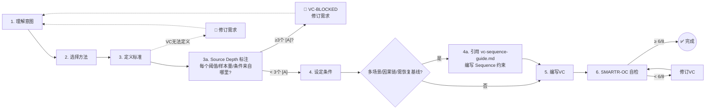
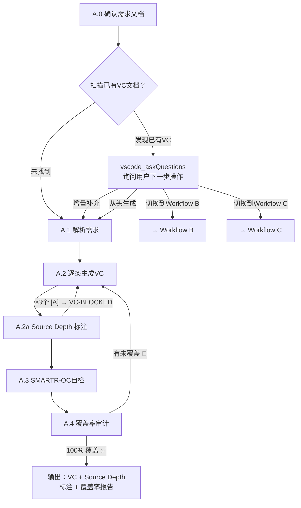
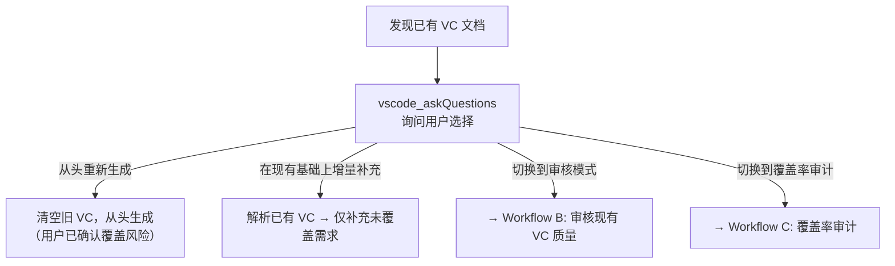
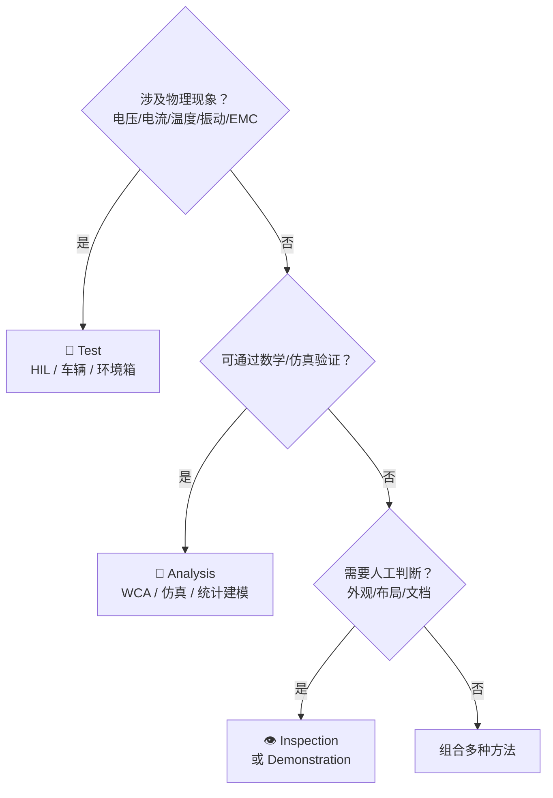

# Workflow A — VC Generation

> Load this file when Workflow A is selected (user wants to **generate** new VCs).
> See `../SKILL.md` for mode selection and VC-First core principles.

Follow VC-First methodology: VC is written simultaneously with each requirement, not after.

## Todo List Template

**IMMEDIATELY after loading this workflow**, call `manage_todo_list` with these items. Mark each `in-progress` before starting and `completed` immediately after finishing.

```
| # | Title | Status |
|---|-------|--------|
| 1 | A.0 确认需求文档来源 | not-started |
| 2 | A.1 解析需求（提取 ID、描述、约束） | not-started |
| 3 | A.2 逐条生成 VC（加载 vc-template.md，按需求类型选择模板） | not-started |
| 4 | A.2a Source Depth 标注（加载 vc-source-depth.md，逐字段溯源） | not-started |
| 5 | A.3 SMARTR-OC 自检（加载 vc-smartr-oc.md，逐条打分） | not-started |
| 6 | A.4 覆盖率审计（100% 覆盖验证 + 覆盖率矩阵） | not-started |
```

> **Important**: If a step is iterative (e.g., A.2 → A.2a → A.3 → A.4 loop-back), keep the todo item `in-progress` until the loop converges. Do NOT mark `completed` prematurely.

### VC-First Operating Loop

For each requirement, execute this 7-step loop (with an optional Step 4a for Sequence constraints). If any step fails, **revise the requirement** — not just the VC.



### Workflow A Steps



## Accepted Input Sources

- A markdown/Excel/CSV file path in the workspace
- Content pasted directly in chat
- A document already open in the editor

---

### A.0 Identify Requirements Source (MANDATORY)

Use `vscode_askQuestions` to ask:

> Which system requirements document would you like me to develop verification criteria for? Please provide the file path or paste the requirements directly.

If the user already mentioned a file, confirm it instead. Once identified, read/parse to understand: how many requirements, IDs and descriptions, any existing VCs.

**If no source is provided, do NOT proceed.**

#### Existing VC Document Detection (MANDATORY)

After identifying the requirements source, **always check** whether an existing VC document already exists for the same requirements (e.g. same directory, matching filename pattern, or document header references the same requirements file). If an existing VC document is found, you MUST use `vscode_askQuestions` to ask the user how to proceed:



**Use this question format:**

> **Header**: "existing-vc-action"
> **Question**: "I found an existing VC document: `{filename}` (covers {N}/{M} requirements, avg SMARTR-OC {score}). What would you like to do?"
> **Options**:
> - **从现有基础上增量补充** — Parse existing VCs, only generate VCs for uncovered requirements (recommended)
> - **从头重新生成全部 VC** — Discard existing VCs and regenerate from scratch
> - **切换到审核模式 (Workflow B)** — Audit the quality of existing VCs instead of generating
> - **切换到覆盖率审计 (Workflow C)** — Run a coverage audit on existing VCs instead of generating

> ⚠️ **Never silently overwrite or ignore an existing VC document.** Always ask the user first. If the user chooses to regenerate from scratch, confirm once more before proceeding.

---

### A.1 Input Parsing

Parse the identified system requirements (table, list, markdown, or free text). For each requirement, extract:
- Requirement ID (or assign one if missing)
- Functional description
- Any implicit constraints, conditions, or performance targets

---

### A.2 VC Generation (per requirement)

**Load `assets/vc-template.md` now** for VC table templates and type-specific structured templates (functional, performance, safety, interface).

**If any requirement has an ASIL level, load `references/vc-safety-patterns.md` now** for safety margin rules, double-100 verification principle, and test coverage matrix.

**If any requirement involves multi-scenario, causal-chain, or baseline-recovery patterns, load `references/vc-sequence-guide.md` now** for the 4-question decision framework and Sequence constraint format.

#### Pre-flight Check

Before filling the 5-element structure, confirm the VC can answer three questions. If any answer is unclear, the requirement itself may need refinement:

1. **What to verify**: Which aspect of which requirement?
2. **How to verify**: Analysis / Inspection / Test / Demonstration?
3. **Pass/Fail criterion**: What result counts as pass?

#### 5-Element VC Structure

Once the three questions are answered, produce a VC with these elements:

| # | Element | Must Include |
|---|---------|--------------|
| 1 | **VC ID** | Unique identifier linked to requirement ID, e.g. `VC-REQ-001` |
| 2 | **Linked Requirement** | The requirement being verified |
| 3 | **Verification Method** | Test / Analysis / Inspection / Demonstration |
| 4 | **Test Conditions** | Five sub-dimensions (all must be addressed):<br>• **Environmental**: Temperature range, humidity, supply voltage, EMC<br>• **Preconditions**: System state (e.g. KL15 ON, vehicle speed = 0, gear = P)<br>• **Equipment**: Rig type (HIL/SIL/Vehicle), measurement device model & precision<br>• **Sample size**: Number of repetitions, statistical confidence requirements<br>• **Time window**: Start/end trigger events and measurement duration |
| 5 | **Pass/Fail Criterion** | Three sub-elements:<br>• **Threshold**: Numeric pass/fail boundary (e.g. `≤ 100ms`, `≥ 95%`, `= 0`)<br>• **Statistical method**: How to conclude from multiple measurements (max/avg/Cpk)<br>• **Precision requirement**: Required accuracy of measurement equipment |

#### Verification Method Decision Tree



#### VC Sentence Template

> Under [test conditions], using [verification method], measure/check [target], verify [criterion], repeat [sample size] times.

---

### A.3 Quality Self-Check (SMARTR-OC)

After writing each VC, run the 8-point SMARTR-OC check. **Load `references/vc-smartr-oc.md`** for the full scoring rubric with operational checklist items.

Score each attribute ✅ only after all its checklist items pass. Total = number of ✅.

- 8/8: ✅ Excellent
- 6-7/8: ⚠️ Acceptable
- < 6/8: ❌ Flag for revision → revise VC → re-check

If a VC repeatedly fails the same attribute, escalate — the underlying requirement may need revision.

---

### A.4 Coverage Audit (MANDATORY — do not skip)

After all VCs are generated and self-checked, run a completeness audit on the full set. **Every requirement must have ≥ 1 VC.** This step cannot be skipped — a VC generation run is incomplete without it.

- **Completeness**: Every requirement must have ≥ 1 VC. Flag any requirement with zero VCs as 🔴 UNCOVERED.
- **Coverage matrix**: Map each requirement to its generated VC(s).
- **Self-correction loop**: If any requirement is UNCOVERED, go back to A.2 and generate the missing VC(s). Re-run A.3 + A.4 until 100% coverage.
- **Output alongside VCs**: Include a summary line: `Coverage: N/N requirements verified (100%)` or `⚠️ N requirements uncovered — VCs pending for: [IDs]`.

> For the coverage audit report template, load `references/vc-report-templates.md#coverage-audit-report-workflow-c`.
