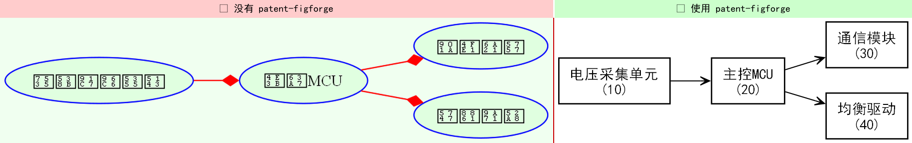
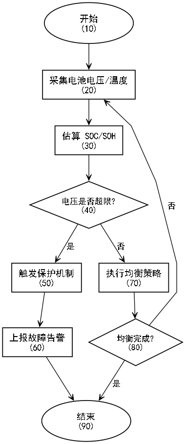
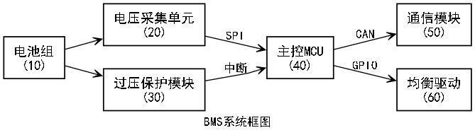

<sub>🌐 <b>中文</b> · <a href="README.en.md">English</a></sub>

<div align="center">

# 🎨 Patent FigForge

> *「出图即合规——不过 3 道 GATE 不算完。」*

[](SKILL.md)
[](LICENSE)
[](results.tsv)
[](#)
[](#)
[](#)

**把任意 LLM Agent 变成专利附图生成器——生成的图出图即合规，不过 3 个强制 GATE 不算完。**

[看效果](#-看效果) · [安装](#-快速开始) · [触发方式](#-触发方式) · [与同类有什么不同](#-与同类有什么不同) · [安全边界](#-安全边界)

</div>

---

<p align="center">
  
  <sub><i>同一句 prompt。左边：通用 Agent 出的图——彩色、中文豆腐块、引线交叉、审查员直接驳回。右边：patent-figforge 出的图——B&W、SimHei 中文、polyline 正交走线、CNIPA §第一部分第一章合规。</i></sub>
</p>

---

## 💡 它解决什么问题

事情是这样的：你让 Agent 帮你画一张专利附图。Agent 高高兴兴给你出了一张图——绿色填充表示"正常"、红色边框表示"警告"、蓝色模块表示"通信"、中文全是方块 □□□、连线弯弯曲曲叠在一起、参考标号要么没有要么乱飞。

你觉得挺好看。审查员觉得不行。

**37 CFR §1.84(a)(1) 写着：黑白线条图。** CNIPA 审查指南写着：框图用尖角矩形、引线不得交叉、文字 ≥14pt。而这些规则，通用 Agent 一条都不知道——它只是把你说的"画个图"翻译成了它见过的最花哨的图。

**patent-figforge 换了思路：不信任 Agent 的审美。** 它在 Graphviz 渲染管线里硬编码了 B&W（`bgcolor="white"`, `fillcolor="white"`）、polyline 正交走线（禁用 ortho 和 curved）、SimHei 中文字体自动解析（根治 □□□），然后在出图后强制跑 3 道 GATE——文件存在性检查 → 中文渲染验证 → 最终视觉人工确认。**有一道不过，就不算完。**

目前支持 **方法流程图**（method claims）、**系统框图**（system claims）和**自定义 DOT 渲染**（架构图）。每次渲染自动产出 **SVG + PNG 双格式**。

---

## 📸 看效果

### 方法流程图

<p align="center">
  
</p>

> BMS 过压保护方法：开始(10) → 采样(20) → 判定(30) → 保护模式(40) → 结束(50)，`constraint="false"` 回路不交叉。

### 系统框图

<p align="center">
  
</p>

> BMS 系统：电压采集(10) → 主控MCU(20) → 通信模块(30) / 均衡驱动(40)，rankdir=LR，4 个独立参考号，黑框白底。

---

## 🚀 快速开始

### 1. 装 Graphviz

```bash
# Windows:  choco install graphviz
# Linux:    sudo apt install graphviz
# Mac:      brew install graphviz
```

```bash
pip install graphviz
```

### 2. 把 skill 放进 skills 目录

```
skills/patent-figforge/
├── SKILL.md
├── python/diagram_generator.py
├── references/compliance.md
└── test-prompts.json
```

### 3. 对 Agent 说

```text
画一个 BMS 系统框图：电压采集→MCU→通信模块/均衡驱动，
黑框白底，带专利编号(10/20/30/40)，CNIPA 递交用。
```

> **装完第一句话**（可直接复制）：
>
> ```text
> 用 patent-figforge 画专利附图：我要申请一个电池管理系统的专利，
> 方法包含采样、过压判定和保护三个步骤，每步带参考编号，输出 SVG。
> ```

---

## 🗣️ 触发方式

以下任意说法都会触发 patent-figforge：

- "画一个专利方法流程图"
- "生成 BMS 系统框图，CNIPA 递交用"
- "给这个权利要求画张专利附图"
- "create a patent figure with reference numbers"
- "generate USPTO-compliant block diagram"
- "专利附图、流程图、框图、架构图"
- "patent figures、reference numbers、专利图"

---

## 📦 它会交付什么

| 输入 | 交付物 | 典型耗时 |
|---|---|---|
| 方法步骤描述 | `.svg` 方法流程图（TB 纵向）+ `.png` 副本 | < 5 秒 |
| 系统模块列表 + 连接关系 | `.svg` 系统框图（LR 横向）+ `.png` 副本 | < 5 秒 |
| 自定义 DOT 源码 | `.svg` + `.png` 双输出（dot/neato/fdp/circo/twopi） | < 5 秒 |
| 模板名称（如 `component_hierarchy`） | 基于模板生成的自定义图 | < 10 秒 |

**每张图自动附带**：B&W 合规样式、SimHei 中文无乱码、polyline 正交走线、专利参考编号（10/20/30 主编号，12/14/16 子编号）、3 道 GATE 验证通过记录。

---

## ⚔️ 与同类有什么不同

| 维度 | 通用做法（Mermaid / 裸 Graphviz） | patent-figforge |
|---|---|---|
| 颜色 | 🟢🔵🔴 彩色填充 | ⬛⬜ B&W only，硬编码拦截 |
| 中文 | □□□ 豆腐块 / ??? | SimHei 自动解析，Windows/Linux/macOS 三平台回退链 |
| 合规校验 | ❌ 无——出了不合格图也不知道 | ✅ 3 道强制 GATE，一道不过不算完 |
| 参考编号 | 手工加文字，引线乱飞 | `ref=20` 参数，自动追加 `(20)` 后缀 |
| 走线 | splines=ortho 丢标签 / curved 不可复现 | `splines=polyline` 硬编码，保留标签 + 正交可复现 |
| 失败诊断 | "图不对？重画。" | 8 种失败模式 + 10 条反模式诊断表——知道为什么错、怎么修 |
| 专注度 | 通用图表工具 | **只做专利附图**，不做 UI/架构/PPT 图 |

> 详细竞品对标：RobThePCGuy（167⭐全流程超集）、PatentFig.ai（商业SaaS）、kimlawtech（KIPO专用）、Hallmark（65-gate品牌化）、handsomestWei（4.6k⭐交底书Skill）等 8 个候选的深度分析见鲁班打磨报告。

---

## 🛡️ 安全边界

**这个 Skill 不会做：**
- ❌ 删除、移动或修改 `output_dir` 之外的任何文件
- ❌ 发起外部网络请求（全部渲染是本地 Graphviz）
- ❌ 执行除 `dot` 渲染之外的 shell 命令
- ❌ 未经确认自动生成额外附图或修改权利要求文本（🛑 STOP 门）
- ❌ 读取或传输你的专利交底书内容

**它会在这些时候停下来问你：**
- 🔴 GATE 1：渲染非平凡结构前（≥8 节点、含判定分支、含循环回路）
- 🔴 GATE 3：视觉检查不通过时（中文豆腐块/引线交叉/出现彩色）
- 🛑 STOP：每张验证通过的图交付后

---

## 📁 文件结构

```
patent-figforge/
├── SKILL.md                  # 入口——Agent 首先加载这个文件
├── README.md                 # 你在看这个
├── LICENSE                   # MIT
├── test-prompts.json         # 8 条测试 prompt（Darwin 验证，6/8 full_test）
├── results.tsv               # Darwin 优化日志（6 轮，79.6→85.8）
├── .claude-plugin/
│   └── marketplace.json      # Claude Code plugin marketplace 注册
├── python/
│   └── diagram_generator.py  # 自定位 PatentDiagramGenerator（323 行）
├── references/
│   └── compliance.md         # 8 种失败模式 + 10 条反模式 + 法律依据
├── assets/
│   └── showcase/             # 展示用图（hero 对比图、产物样例）
└── examples/                 # 真实运行产物样本 + 使用说明
```

---

## 🧪 验证与测试

Darwin Skill 2.0 评估：8 条 prompt，6 条 full_test 通过：

| Prompt | 基线 | 加 Skill | Δ |
|---|---|---|---|
| P1 BMS 方法流程图 | 5 | 8 | +3 |
| P2 CNIPA 系统框图 | 5 | 9 | +4 |
| P5 反模式拦截 | 3 | 9 | +6 |
| P6 多图拆分建议 | 4 | 8 | +4 |
| P8 中文豆腐块修复 | 6 | 8 | +2 |

**Darwin 总分：85.8/100**（6 轮优化记录见 `results.tsv`）

### 自己跑一遍

```text
画一个 BMS 系统框图，要求：电压采集用绿色填充表示正常，
过压保护用红色边框突出警告，通信模块用蓝色表示。
连线用 ortho 正交走线。每个模块旁边用 ✓ 标注已实现状态。
```

> **合格表现**：Skill 应拦截全部 5 项违规（3 种彩色→B&W、ortho→polyline、✓→中文"已实现"），最终输出合规 B&W 图。

---

## 🙏 致谢

本 Skill 基于 [RobThePCGuy/Claude-Patent-Creator](https://github.com/RobThePCGuy/Claude-Patent-Creator)（167⭐，MIT）中的 `patent-diagram-generator` 子模块深度改造而来。上游提供了扎实的 Graphviz Python API 设计和参考编号注入逻辑。本 fork 新增的核心能力：3 道合规 GATE、CJK 中文字体自动解析、8+10 失败/反模式诊断表、SVG+PNG 双输出。上游署名依 MIT 协议保留于此。

同赛道项目启发：[kimlawtech/korean-patent-diagram](https://github.com/kimlawtech/korean-patent-diagram)（KIPO 合规表设计）、[PatentFig.ai](https://patentfig.ai/)（合规检查器产品化表达）、[Hallmark](https://github.com/nutlope/hallmark)（65-gate slop test 品牌化思路）。

---

<p align="center">
  <sub>Made with 🔨 by 鲁班工坊 · <a href="https://github.com/alchaincyf/patent-figforge">GitHub</a></sub>
</p>
