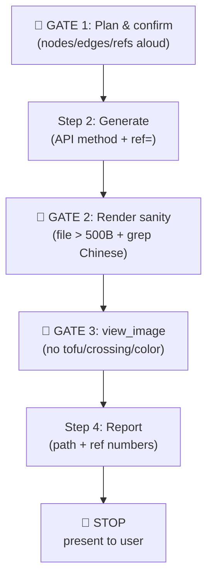

# 🎨 Patent FigForge

> **Production-ready AI skill that generates patent-style technical diagrams — flowcharts, block diagrams, system architectures — using Graphviz with automatic reference numbering. Output dual SVG + PNG, ready for CNIPA / USPTO / EPO filing.**

<p align="center">
  <strong>
    <a href="#-quick-start">Quick Start</a> ·
    <a href="#-three-api-methods">3 API Methods</a> ·
    <a href="#-gated-workflow">Gated Workflow</a> ·
    <a href="#-cjk--cnipa-compliance">CJK + CNIPA</a> ·
    <a href="#-file-structure">Structure</a>
  </strong>
</p>

<p align="center">
  
  
  
  
  
</p>

---

## English Description

**`patent-figforge`** is a framework-agnostic AI skill (a self-contained `SKILL.md` + a `python/diagram_generator.py` module + compliance references) that turns any LLM agent — Claude Code, GitHub Copilot, Cursor, or anything that reads Markdown — into a **patent diagram generator** that produces filing-ready technical illustrations.

It solves the most common failure mode in AI-assisted patent diagram generation: **the diagram looks plausible but is non-compliant**. Generic Graphviz outputs use colored fills (CNIPA requires black-on-white), omit reference numbers (10, 20, 30…), garble Chinese glyphs (tofu □□□), route back-edges across the main flow, or use `splines=spline` (curved) instead of `polyline`. This skill forbids all of that via 3 mandatory GATEs.

It supports **method flowcharts** (for method claims), **block diagrams** (for system claims), and **custom DOT rendering** (for architectures). Every render emits **dual SVG + PNG** automatically — SVG is the editable vector source for filing, PNG is the visual verification gate.

---

## 🌐 中文简介

**`patent-figforge`** 是一个**框架无关**的 AI Skill —— 把一份 `SKILL.md` + 一个自定位的 `python/diagram_generator.py` 模块 + 合规参考文档加载进任意 LLM Agent，让大模型真正胜任**专利附图绘制**——生成符合 CNIPA（中国国家知识产权局）/ USPTO / EPO 递交要求的技术插图。

它解决的是 AI 辅助专利附图绘制最常见的失败模式：**图看似专业，实则不合规**。通用 Graphviz 输出会使用彩色填充（CNIPA 要求黑白）、遗漏参考标号（10、20、30…）、中文乱码（豆腐块 □□□）、back-edge 横穿主流、或用 `splines=spline`（曲线）而非 `polyline`（折线）。本 skill 通过 3 个强制 GATE 把这些做法**全部禁止**。

---

## ✨ Key Features

- ✅ **3 API methods** — `create_flowchart` (method claims, TB layout) / `create_block_diagram` (system claims, LR layout) / `render_dot_diagram` (custom DOT)
- ✅ **Dual SVG + PNG output** — every render emits both; SVG is the editable vector source, PNG is the `view_image` verification gate
- ✅ **Automatic reference numbering** — in-label `ref=` parameter (e.g. `{"id": "cpu", "label": "处理器", "ref": 20}`) appends `(20)` cleanly with no lead lines
- ✅ **3 mandatory GATEs** — GATE 1 (plan & confirm) / GATE 2 (render sanity, file > 500 bytes + Chinese glyph grep) / GATE 3 (`view_image` visual verification, no tofu / no crossing edges / no color)
- ✅ **CJK auto-resolution** — SimHei font auto-resolved on Windows via `_resolve_cjk_font()`; Chinese labels render without tofu
- ✅ **CNIPA compliance** — `splines=polyline` (Anti-Pattern #2/#5 fix) + `bgcolor=white` (Anti-Pattern #1) + black-on-white only
- ✅ **Back-edge handling** — `constraint="false"` on loop-back edges routes them as back-arcs outside the rank chain (no rank reordering, no crossing)
- ✅ **Self-locating module** — `python/diagram_generator.py` works in any runtime, no env var needed; walks up from CWD or `__file__` to find itself

---

## 🚀 Quick Start

### 1. Install dependencies

**Graphviz** (system binary):
```bash
# Windows
choco install graphviz
# Linux
sudo apt install graphviz
# Mac
brew install graphviz
```

**Python package**:
```bash
pip install graphviz
```

### 2. Load the module and render

```python
import os, sys
# Self-locating: works in any runtime, no env var needed
_SKILL_ROOT = r"c:\path\to\patent-figforge"  # or auto-detect
sys.path.insert(0, _SKILL_ROOT)

# Ensure Graphviz `dot` is on PATH (Windows ships NOT on PATH by default)
for _dot_dir in (r"C:\Program Files\Graphviz\bin", r"/usr/bin", "/usr/local/bin"):
    if os.path.exists(os.path.join(_dot_dir, "dot.exe")) or os.path.exists(os.path.join(_dot_dir, "dot")):
        os.environ["PATH"] = _dot_dir + os.pathsep + os.environ.get("PATH", "")
        break

from python.diagram_generator import PatentDiagramGenerator

generator = PatentDiagramGenerator(output_dir=".")

# Example: A CNIPA BMS system block diagram
blocks = [
    {"id": "vadc", "label": "电压采集单元", "ref": 10},
    {"id": "mcu",  "label": "主控 MCU",     "ref": 20},
    {"id": "comm", "label": "通信模块",      "ref": 30},
    {"id": "bal",  "label": "均衡驱动",      "ref": 40},
]
connections = [
    ["vadc", "mcu"],
    ["mcu",  "comm"],
    ["mcu",  "bal"],
]
diagram_path = generator.create_block_diagram(
    blocks=blocks,
    connections=connections,
    filename="bms_block",
    output_format="svg",   # always emits svg + png; arg only picks returned path
    rankdir="LR",          # CNIPA block diagrams default to LR
)
# Rendered: 4 boxes (电压采集单元(10) / 主控MCU(20) / 通信模块(30) / 均衡驱动(40)),
# black-on-white, splines=polyline, SimHei glyphs — CNIPA §第一部分第一章 compliant.
```

### 3. The skill enforces 3 GATEs

```
🔴 GATE 1 · Plan & confirm
List nodes/blocks/edges/reference numbers aloud. >3 numbers with lead lines → split into multiple figures.

Step 2 · Generate
Run the API method. Use in-label ref= for reference numbers (Anti-Pattern #6).

🔴 GATE 2 · Render sanity
Confirm SVG > 500 bytes. Grep one Chinese label in SVG source (tofu check).

🔴 GATE 3 · view_image verification (MANDATORY)
Open the PNG. Verify: (a) Chinese glyphs render (no □□□), (b) edges don't cross except intentional branches,
(c) reference numbers legible, (d) no color (black on white).

Step 4 · Report
Show file path + list reference numbers used.
🛑 STOP: present verified figure to user. Do not auto-generate additional figures without confirmation.
```

---

## 🧭 Three API Methods

| Method | Use Case | Default Layout | Signature |
|---|---|---|---|
| `create_flowchart(steps, filename, output_format)` | Method claims, decision trees, process flows | **TB** (auto-applied, not caller-controlled) | `steps=[{id, label, shape, next}]` |
| `create_block_diagram(blocks, connections, filename, output_format, rankdir, title)` | System claims, hardware/software modules | **LR** (pass `TB` for top-down hierarchy) | `blocks=[{id, label, ref}]`, `connections=[[from, to, label?]]` |
| `render_dot_diagram(dot_code, filename, output_format, engine)` | Custom architectures, unusual layouts | engine-dependent | Raw DOT string |

**Shape quick reference**:
- Flowchart: `ellipse` (start/end) / `box` (process) / `diamond` (decision) / `parallelogram` (I/O) / `cylinder` (DB)
- Engines: `dot` (hierarchical, default for patents) / `neato` / `fdp` / `circo` / `twopi`

---

## 🗺️ Gated Workflow



> GATE 3 exists because graphviz auto-layout can produce geometrically broken output (crossing lead lines, overlapping labels) that a file-size check will not catch. **Do NOT declare success based on "the file exists" alone.**

---

## 📐 CJK + CNIPA Compliance

| Rule | Why | How |
|---|---|---|
| `splines="polyline"` | CNIPA rejects curved splines; polyline is the standard | Hard-coded in renderer (Anti-Pattern #2/#5 fix) |
| `bgcolor="white"` | Black-on-white only for filing | Hard-coded in renderer (Anti-Pattern #1) |
| SimHei font auto-resolution | Chinese glyphs render without tofu □□□ | `_resolve_cjk_font()` on Windows |
| Reference numbers via in-label `ref=` | Clean `(20)` suffix, no lead lines | `{"id": "cpu", "label": "处理器", "ref": 20}` |
| `constraint="false"` on back-edges | Loop-back routes as back-arc, no rank reordering | `next=[{id, label, constraint: "false"}]` |

**Numbering convention**: main components 10/20/30/40…; sub-components 12/14/16 under 10; elements 22/24/26 under 20. Each number denotes exactly ONE element within a figure.

---

## 📁 File Structure

```
patent-figforge/
├── SKILL.md                            # Entry point — agent loads this first
├── README.md                           # You are here
├── python/
│   └── diagram_generator.py            # Self-locating module (PatentDiagramGenerator class)
└── references/
    └── compliance.md                   # CNIPA/USPTO/EPO compliance rules + 6 Anti-Patterns
```

> **Note**: This is a **lean skill** — the `python/diagram_generator.py` module is the single source of truth for rendering. Previous `assets/*-skeleton.py` and `references/{code-templates,numbering,patent-standards,requirements-common,shape-specs}.md` have been consolidated into the module + `compliance.md`.

---

## ⛔ Anti-Patterns (6 hard-coded prohibitions)

| # | Forbidden | Why | Replace with |
|---|---|---|---|
| 1 | Colored fills / `bgcolor != white` | CNIPA requires black-on-white | `bgcolor="white"` (hard-coded) |
| 2 | `splines=spline` (curved) | CNIPA rejects; polyline standard | `splines="polyline"` (hard-coded) |
| 3 | > 3 reference numbers with lead lines | Cluttered, illegible | Split into multiple figures |
| 5 | Curved splines (variant of #2) | Same as #2 | Same as #2 |
| 6 | Post-hoc `add_reference_numbers()` on existing SVGs | Fragile, lead-line chaos | In-label `ref=` parameter |

---

## 🤝 Compatibility

- **Agents**: Claude Code, GitHub Copilot, Cursor, Continue, any agent that consumes `SKILL.md` and can run Python
- **Inputs**: Python dicts (blocks/steps/connections) or raw DOT strings
- **Outputs**: SVG (vector, editable, filing source) + PNG (raster, verification gate, docx/pptx embedding)
- **Filing Standards**: CNIPA (中国) · USPTO (美国) · EPO (欧洲) · JPO (日本)
- **Languages**: English + 中文 (CJK auto-resolution)
- **Companion skill**: [`patent-forge`](../patent-forge) calls this skill for Phase 3A Action 6 / Phase 3D Action 6 figure generation

---

## 📜 License

Licensed under the **Apache License 2.0** — see the repository root [`LICENSE`](../LICENSE).

> 📌 **Note on PDF**: This skill outputs SVG + PNG only. If filing requires PDF, convert the SVG externally (e.g. `rsvg-convert -f pdf in.svg -o out.pdf` or Inkscape CLI). Word cannot inline-embed SVG — that's why PNG is emitted automatically.

---

## 🙏 Acknowledgements

Part of the [**autoskill-hub**](https://github.com/UnknowCao/autoskill-hub) project — the open skill hub that walks the entire automotive V-model, mapped to ASPICE.

This skill is the **diagram-side companion** to [`patent-forge`](../patent-forge). Together they cover: invention disclosure → patent filing → compliant technical diagrams.

Contributions welcome — new shape templates, additional filing-standard compliance rules, and rendering engine integrations are especially appreciated. See [`CONTRIBUTING.md`](../CONTRIBUTING.md) at the repository root.
