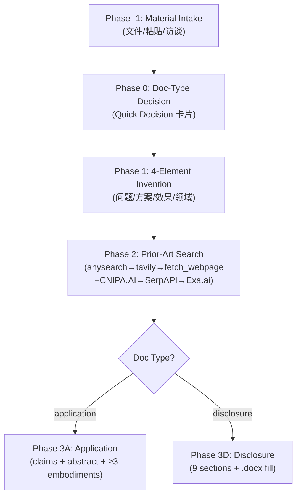

# 📜 Patent Forge

> **Production-ready AI skill that turns a fuzzy technical idea into a complete Chinese patent document — 技术交底书 (invention disclosure for patent agents) or 专利申请表 (filing-ready with claims & abstract).**
> Aligned with **中国《专利法》第 26 条**（公开充分 + 权利要求清楚/支持）、**实施细则 22-23 条**、以及 **《专利审查指南 2023》第二部分第二章**.

<p align="center">
  <strong>
    <a href="#-quick-start">Quick Start</a> ·
    <a href="#-two-doc-types">2 Doc Types</a> ·
    <a href="#-phase-workflow">Phase Workflow</a> ·
    <a href="#-language-conventions">Language Conventions</a> ·
    <a href="#-file-structure">Structure</a>
  </strong>
</p>

<p align="center">
  
  
  
  
  
</p>

---

## English Description

**`patent-forge`** is a framework-agnostic AI skill (a self-contained `SKILL.md` + supporting references, templates & scripts) that turns any LLM agent — Claude Code, GitHub Copilot, Cursor, or anything that reads Markdown — into a **senior patent engineer** capable of drafting complete Chinese patent documents from a one-sentence invention idea.

It solves the most common failure mode in AI-assisted patent drafting: **the agent produces a plausible-sounding document that is legally defective**. Generic LLMs write claims with forbidden words like "approximately" (automatically rejected under 专利法 26.4), disclose embodiments too sparse to satisfy 公开充分 (专利法 26.3), use product names instead of generic terms, or invent prior art. This skill forbids all of that.

It supports the **full invention-to-filing pipeline**: material intake (Phase −1) → document-type selection (Phase 0) → 4-element invention understanding (Phase 1) → prior-art search with CNIPA.AI / SerpAPI / Exa.ai layered fallback (Phase 2) → document drafting with hard checkpoints (Phase 3) → `.docx` template filling for ACIP 华进 and other patent agencies.

---

## 🌐 中文简介

**`patent-forge`** 是一个**框架无关**的 AI Skill —— 把一份 `SKILL.md` + 配套参考文档、模板与脚本加载进任意 LLM Agent（Claude Code / GitHub Copilot / Cursor 等能读 Markdown 的都行），让大模型真正胜任**中国专利文件撰写**——从一句话发明点，到完整的「技术交底书」（发明人 → 代理师）或「专利申请表」（含权利要求书 + 摘要，可直接递交）。

它解决的是 AI 辅助专利撰写最常见的失败模式：**文档看似专业，实则法律缺陷**。通用 LLM 写出的权利要求会出现"大约""优选"等绝对禁用词（命中即按专利法 26.4 驳回），实施方式过于稀疏无法满足公开充分（专利法 26.3），使用产品名而非通用化术语，甚至凭空编造现有技术。本 skill 把这些做法**全部列为禁止项**，并给出强制替代方案。

---

## ✨ Key Features

- ✅ **Two doc types, one skill** — `disclosure`（技术交底书，代理师撰写权利要求）/ `application`（专利申请表，含权利要求书 + 摘要），通过 Quick Decision 卡片 10 秒判定
- ✅ **Phase-gated workflow** — Phase −1 (material intake) → 0 (doc-type) → 1 (4-element invention) → 2 (prior-art search) → 3 (drafting); each phase has mandatory CHECKPOINTs
- ✅ **Language Conventions (强制加载)** — 权利要求绝对禁用词清单（大约/优选/良好/稳定...）+ 法条驳回依据映射 + § 4 表达级规范（数值/单位/公式/参考标号/术语一致性）
- ✅ **6 domain matrices** — claims 范式 / 实施例维度 / 附图类型按 6 领域适配（软件/机械/电子/化学/混合/不确定），**禁止跨领域套用**
- ✅ **Prior-art search layered fallback** — 主搜索（anysearch → tavily → fetch_webpage）+ 专利 API 增强层（CNIPA.AI 首选 → SerpAPI → Exa.ai）+ IPC/CPC 二次检索 + 检索审计日志
- ✅ **`.docx` template filling** — 100% 匹配代理机构（ACIP 华进等）的 `.docx` 版式，自动嵌入附图（`fill_acip_template.py fill`），无需手动排版
- ✅ **21 hard-coded anti-patterns** — 模糊词、编造数值、跳过 Checkpoint、跨领域套用、非 ACIP 代理不暂停... 全部禁止并给出强制替代
- ✅ **Dogfood examples** — 软件类（Focus Period 推荐，14 claims）/ 机械类（可折叠充电桩，14 claims，参考标号 10-83）/ 混合类 HW+SW（BMS SOH 监测，14 claims）

---

## 🚀 Quick Start

### 1. Load the skill into your agent

**Claude Code** / **Cursor** / **Copilot** — copy this folder into your agent's skills directory, or point the agent at `SKILL.md`. The skill auto-routes based on your phrasing.

### 2. Just ask — the skill picks the doc type

```
# 技术交底书 (disclosure，递交给华进/ACIP 代理师)
帮我写一份技术交底书，发明是一种基于 LLM 的需求验证标准生成方法，通过华进提交

# 专利申请表 (application，含权利要求书 + 摘要)
帮我写专利申请文件：一种用于 BMS 的 SOH 在线监测方法

# 含素材输入（Phase -1）
读取 c:\research\invention_notes.md 后帮我写交底书
```

### 3. The skill enforces quality gates

You'll see structured checkpoints like:

```
🛑 CHECKPOINT 3D-draft
草稿已完成并通过 Action 8 语言规范自检（20 处禁用词扫描：19 合规引用 + 1 已修复）。
请审阅第四节是否符合"公开充分"，确认后进入 CHECKPOINT 4D。

✅ 16 字段全部填充 | 7 张附图全部嵌入 | ACIP 9 节结构合规
Disclosure-ACIP-VC-LLM-20260728.docx (429 KB)
```

If your draft uses "approximately" / "优选" in claims → it is **blocked** until you replace it with a concrete value or range.

---

## 🧭 Two Doc Types

| `--doc-type` | 文档名 | 模板 | 受众 | 含权利要求书 + 摘要？ |
|---|---|---|---|---|
| `application` | **专利申请表** | `assets/templates/standard_application.md` | 专利局（最终递交）| ✅ |
| `disclosure` | **技术交底书** | `assets/templates/acip_invention_disclosure.md`（其他代理见 `template_registry.md`）| 代理师（如 ACIP 华进）| ❌（代理师后续撰写）|

**Output Format**：
- `application` → `--md`（标准申请表无代理机构专属模板，统一 Markdown）
- `disclosure` → **`--docx`（强制）**，100% 匹配代理机构 `.docx` 版式（自 2026-07-27 起附图默认嵌入）

---

## 🗺️ Phase Workflow



| Phase | Goal | Hard Gate |
|---|---|---|
| −1 | Material intake（文件转换、访谈、Phase 0 合并为一次 askQuestions）| 不预设用户路径（Anti-Pattern #21）|
| 0 | Doc-type selection（10 秒 Quick Decision）| 无法判定 → askQuestions（禁止默认 application）|
| 1 | 4-element invention + 素材预载 + 结构化访谈 | CHECKPOINT 1 |
| 2 | Prior-art search + 新颖性分析 + IPC 分类 + 审计日志 | CHECKPOINT 2 |
| 3A | Claims drafting（二段式 + 引用基础）| **CHECKPOINT 3A-claims** 必须暂停等用户确认保护范围 |
| 3D | Disclosure drafting（9 节 + 语言自检）| **CHECKPOINT 3D-draft** + **CHECKPOINT 4D** 双重暂停 |
| Final | `.docx` template fill（自动嵌入附图）| filled/skipped 字段校验 |

---

## 📐 Language Conventions

> 本节是 patent-forge 撰写中英文专利文档时的**语言规范单一事实源**。对齐中国《专利法》第 26 条、实施细则第 22-23 条、《专利审查指南 2023》第二部分第二章。

**权利要求绝对禁用词**（命中即按专利法 26.4 驳回）：

| 类别 | ❌ 禁用 | ✅ 替代 |
|---|---|---|
| 模糊范围 | 优选地 / 较佳地 | 删除，把优选范围写入从属权利要求 |
| 不确定数量 | 大约 / 约 / 大概 / 左右 | `5V±0.1V` / `4.9V-5.1V` / `≥100MΩ` |
| 主观判断 | 良好 / 高效 / 快速 / 稳定 | `信噪比 ≥ 30dB` / `响应时间 ≤ 100ms` |
| 模糊程度 | 适当 / 合适 / 必要 / 基本 | 删除或量化：`温度维持在 25°C±2°C` |
| 商业宣传 | 革命性 / 突破性 / 业界领先 | 删除——专利文档禁止商业宣传语 |

**草稿完成后必须 grep 自检**（Phase 3A Action 2 / Phase 3D Action 8 强制）。

---

## 📁 File Structure

```
patent-forge/
├── SKILL.md                            # Entry point — agent loads this first
├── README.md                           # You are here
├── references/                         # Loaded on-demand by phase/step
│   ├── shared_workflow.md              #   Phase -1/0/1/2 + Output Layout + 共通质量原则
│   ├── api_and_terminology.md          #   CNIPA.AI/SerpAPI/Exa.ai + Language Conventions ⚖️
│   ├── domain_matrix.md                #   6 领域 × (claims 范式 / 实施例维度 / 附图类型)
│   ├── application_example.md          #   dogfood · 软件类（Focus Period，14 claims）
│   ├── application_example_mechanical.md #  dogfood · 机械类（可折叠充电桩，14 claims）
│   ├── application_example_hybrid.md   #   dogfood · 混合类 HW+SW（BMS SOH，14 claims）
│   ├── docx_mode.md                    #   --docx 模式详细步骤 + 错误处理 + 新代理接入
│   ├── anti_patterns.md                #   完整 21 条 Anti-Patterns + Error Handling Matrix
│   └── quality_checklists.md           #   清单 A (application) + 清单 D (disclosure)
├── assets/
│   ├── templates/
│   │   ├── template_registry.md        #   代理机构模板注册表 + 关键词映射
│   │   ├── standard_application.md     #   application 模板（专利申请表）
│   │   └── acip_invention_disclosure.md #  disclosure 模板（ACIP 华进 9 节结构）
│   └── raw_templates/
│       └── acip_invention_disclosure.docx # 原始 ACIP .docx 模板（--docx 模式用）
└── scripts/
    └── fill_acip_template.py           # --docx 填充工具（subcommands: fill/inspect/list）
```

---

## ⛔ Anti-Patterns (21 hard-coded prohibitions)

A few highlights — full list in `references/anti_patterns.md`:

| # | Forbidden | Why | Replace with |
|---|---|---|---|
| 1 | Vague words in claims (大约/优选) | 命中即按专利法 26.4 驳回 | Concrete value or range |
| 3 | Default to `application` when doc-type unclear | 用户实际可能要 disclosure | askQuestions 询问 |
| 16 | Cross-domain claim template reuse | 软件范式套到机械上，保护范围错乱 | 按 Phase 1 领域分类加载对应范式 |
| 17 | Fabricating prior art | 编造对比专利，新颖性分析失真 | 真实检索 + 审计日志 + "未检索到"明确说明 |
| 18 | Non-ACIP agency without checkpoint | 用错代理机构模板 | **仅允许暂停**等用户放入专属 .docx |
| 21 | Presume user will upload material | 违反"不预设"原则 | 三选项平等呈现，等用户实际选择 |

---

## 🤝 Compatibility

- **Agents**: Claude Code, GitHub Copilot, Cursor, Continue, any agent that consumes `SKILL.md`
- **Inputs**: `.md` / `.docx` / `.pdf` / `.xlsx` / `.png` (via `markitdown-enhanced` skill conversion)
- **Standards**: 中国《专利法》第 26 条 · 实施细则 22-23 条 · 《专利审查指南 2023》· ASPICE SYS.2 BP5（与 verification-criteria skill 联动）
- **Patent Agencies**: ACIP 华进（已内置 .docx 模板）/ 三环 / 中科（通过 Checkpoint 接入专属模板）
- **Languages**: 中文为主（专利文档要求），关键术语保留英文全称

---

## 📜 License

Licensed under the **Apache License 2.0** — see the repository root [`LICENSE`](../LICENSE).

> ⚖️ **法律免责声明**：Patent Forge 产出的文档为 AI 辅助生成的技术草稿，**不构成法律意见**。提交专利申请前，必须由具备执业资质的专利代理师或专利律师审核。本 skill 无法替代专业法律服务。

---

## 🙏 Acknowledgements

Part of the [**autoskill-hub**](https://github.com/UnknowCao/autoskill-hub) project — the open skill hub that walks the entire automotive V-model, mapped to ASPICE.

This skill is the **authoring-side companion** to [`verification-criteria`](../verification-criteria) (which serves the verification side). Together they cover: invention disclosure → patent filing → requirement VC → test case.

Contributions welcome — new domain matrices, additional agency templates, and real-world case studies are especially appreciated. See [`CONTRIBUTING.md`](../CONTRIBUTING.md) at the repository root.
