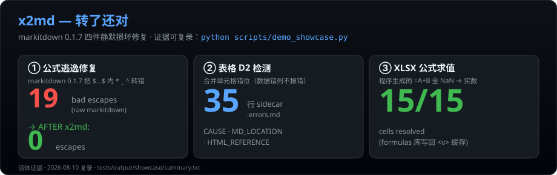

# x2md


> **万物 → Markdown。** 基于 Microsoft MarkItDown，补上本家做不到的四件事：公式不乱码、表格不错列、加密不卡壳、NaN 变实数。

[](https://pypi.org/project/markitdown/)
[](https://www.python.org/)
[](LICENSE)
[](scripts/demo_showcase.py)
[](https://github.com/UnknowCao/autoskill-hub/tree/main/skills/x2md)

[看证据](#看得见的证据showcase可一键复录) · [安装](#快速开始) · [触发方式](#触发方式) · [比本家强在哪](#为什么不不只是用本家-markitdown) · [安全边界](#安全边界)

---

## 支持哪些格式 → Markdown？

x2md（基于 MarkItDown 0.1.7）把下面这些格式转成干净的 Markdown：

| 类别 | 扩展名 | 说明 |
|---|---|---|
| **Office 文档** | `.docx` `.doc` `.pdf` `.pptx` `.xlsx` `.xls` | 文字、表格、标题层级、列表、基础格式 |
| **网页/电子书** | `.html` `.htm` `.epub` | 提取正文，去导航/广告 |
| **结构化数据** | `.csv` `.json` `.xml` | 表格/键值/树形 → Markdown 表格 |
| **图片（OCR）** | `.png` `.jpg` `.jpeg` `.gif` `.webp` `.bmp` `.tiff` | 需配 OCR 依赖；附图/扫描件/截图提取文字 |
| **音频（转录）** | `.mp3` `.wav` `.m4a` | 需配转录依赖；会议录音 → 文字 |
| **视频字幕** | YouTube URL | 拉取字幕 + 标题 + 时长 + 元数据 |
| **其他** | `.vsd` `.vsdx`（Visio） | 建议请用户导出 `.svg`；附图场景优先矢量 |

纯文本/代码（`.md` `.txt` `.py` `.js` `.svg` 等）无需转换，直接 `read_file`。

---

## 为什么不只是用本家 markitdown？

本家 MarkItDown 遇到下面这些**真实场景**会出错或卡住——x2md 把每一条都补上了。每个修复都标了事故来源（见 SKILL.md 的 14 条 ⛔ Do-NOT）。

| 你遇到的情况 | 本家 markitdown | **x2md** |
|---|---|---|
| Word 里有数学公式 `$a*b=c^2$` | ❌ 变成 `\*b=c^2\`，KaTeX 报错 | ✅ **自动修复**（0.1.7 上游 bug 仍存在，实测 `$a * b = c^2$` → 本家输出 `\ * b = c^2\`） |
| 表格有合并单元格（rowspan/colspan） | ❌ 列悄悄错位，**数据错列不报错** | ✅ **Python 检测 + AI 自动修复**（sidecar 报错 + HTML 真值重对齐） |
| Word/Excel 有密码保护 | ❌ 直接抛异常，停了 | ✅ **弹 Windows CredUI 输密码**（密码不过 chat、不落盘），解密后继续转 |
| Excel 公式 `=A2+B2`（程序生成） | ❌ 显示 `NaN`（markitdown 只读缓存值） | ✅ **`formulas` 库求值**，写回实数；部分求值失败时打告警 |
| 嵌套表格（表里有表） | ❌ 展平成一团，下游 LLM 读不懂 | ✅ **正文写自然语言描述 + 保留展平输出** |
| 几百/几千个文件批量转 | ❌ 自己写循环，中断重来 | ✅ `batch_convert_dynamic` 一键跑，**断点续跑**（已转的 `.md` 自动跳过） |
| 网络盘上大文件集 | ❌ 单一超时，挂死 | ✅ **size-aware 超时分级**（小文件先跑、大文件限并发、慢机器自动加时） |
| 元数据追溯 | ❌ 不知道 .md 来自哪个源文件 | ✅ **元数据头注入**（`Source` / `Format` 写在 .md 首部） |

**一句话：装 x2md = 把 14 条血泪事故经验装进 Agent 的脑子。** 本家能转，x2md 转了还对。

<details>
<summary><b>完整能力清单（点开）</b></summary>

| 能力 | 本家 markitdown | **x2md** |
|---|---|---|
| DOCX / PDF / PPTX / XLSX / HTML / CSV / JSON / XML 转 Markdown | ✅ | ✅ |
| EPUB / 图片 OCR / 音频转录 / YouTube 字幕 | ✅ | ✅ |
| AI 增强图片描述（OpenRouter） | ✅ | ✅ |
| Docker 部署 | ✅ | ✅ |
| 公式逃逸自动修复（`$...$` 内 `\*`→`*`） | ❌ | ✅ |
| 加密 `.docx` / `.xlsx` 解密转换 | ❌ | ✅ |
| 复杂表格结构检测 + AI 自动修复 | ❌ | ✅ |
| XLSX 公式求值（`=A+B`→实数，非 NaN） | ❌ | ✅ |
| 大批量/网络盘断点续跑（size-aware resumable batch） | ❌ | ✅ |
| 元数据头注入（Source / Format） | ❌ | ✅ |
| 反模式文档（14 条 ⛔ Do-NOT） | ❌ | ✅ |
| 退出码协议（0=干净 / 1=需修复） | ❌ | ✅ |
| Windows CredUI 集成解密 | ❌ | ✅ |

</details>

---

## 快速开始

### 一行安装

autoskill-hub 是多 skill 仓库。装整个 hub（含 x2md + patent-forge + verification-criteria 等）：

```bash
npx skills add UnknowCao/autoskill-hub
```

只要 x2md？手动 clone 这个子目录到你的 `skills/x2md/` 下即可——x2md 是纯 Python 脚本，零编译：

```bash
git clone --depth 1 https://github.com/UnknowCao/autoskill-hub.git
cp -r autoskill-hub/skills/x2md ~/.claude/skills/x2md   # 或你的 agent skills 目录
```

### Python 依赖

```bash
# 本家的依赖
pip install "markitdown[all]"

# x2md 多这 4 个包——每个替你省一类坑：
pip install msoffcrypto-tool keyring mammoth pywin32

# XLSX 公式求值（=A+B → 实数，不装则公式格显示 NaN）：
pip install formulas
```

> ⚠️ **venv 提示**：本仓库历史上有两个 venv——`.venv`（全依赖，推荐）和 `.venv-markitdown`（缺 `msoffcrypto`）。请用 **`.venv`** 或自建一个装齐上述 5 个增强包的环境。验证一行：
> ```bash
> python -c "import markitdown, msoffcrypto, keyring, mammoth, win32cred, formulas; print('deps ok')"
> ```

### 装完第一句话

装完对 Agent 说（可直接复制）：

```text
把这个 docx 转成 markdown：技术方案.docx
```

Agent 会自动走全管道——加密检测 + 公式求值 + 转换 + 公式修复 + 表格检测 + 元数据头。完成给一行总结。

### 命令行直跑

```bash
# 单文件，全增强管道（加密检测 + 公式求值 + 转换 + 公式修复 + 表格检测 + 元数据头）
python scripts/_convert_core.py 你的文件.docx -o 输出.md

# 批量转一个目录（并行，跳过 Office 锁定文件 ~$*）
python scripts/batch_convert.py 输入目录/ 输出目录/ --extensions .docx --workers 4

# 大批量/网络盘——可恢复，不怕中断
python scripts/batch_convert_dynamic.py --source 大目录/ --recursive --outdir 输出/ --workers 13
```

转换完成，一行总结。如果表格有问题，Agent 自动修——不问你。

---

## 它凭什么比本家强？四件本家没有的东西

### 1. 公式逃逸自动修复

markitdown 0.1.7 把 `$...$` 里的 `*` `_` `^` 错误地转义成 `\*` `\_` `\^`，KaTeX/MathJax 渲染直接报错。**Bug 确认仍存在于 0.1.7**（2026-08-06 实测：`$a * b = c^2$` → `\ * b = c^2\`）。

x2md 每次转换后自动扫描并修复——不需要你手动调，不需要你发现。

### 2. 加密文件解密（密码不过 chat）

本家遇到加密 `.docx/.xlsx` 直接抛异常。x2md 走四步密码解析链：

```
keyring 缓存 → 进程内缓存 → Windows CredUI 弹窗 → 放弃跳过
```

关键安全保证：
- 密码通过 **Windows 原生 CredUI 对话框**输入——不经过 chat、不写日志、不落盘
- AI 永远看不到明文密码
- 记住密码存在 keyring（DPAPI 加密），不存 Windows Generic Credential

### 3. 表格结构验证 + AI 自动修复（B+D 架构）

markitdown 转换复杂表格时：合并单元格的列悄悄左移，嵌套表格展平后语义全丢。这些是**静默数据损坏**——转了，但数据错了，而且不报错。

x2md 的两阶段管道：

```
Stage 1（Python 脚本）             Stage 2（AI Agent）
     │                                   │
 检测合并单元格错位              读 sidecar 报错文件
 检测嵌套表格                      │
     │                          Known 缺陷 → 自动修复（不问你）
 写入 .errors.md               Unknown 有 HTML 参考 → 尽力修复 + 标注
 exit code = 1                  Unknown 无 HTML 参考 → 唯一停点：问你
```

已知缺陷类型（当前检测）：

| 缺陷 | 严重度 | AI 动作 |
|---|---|---|
| `vertical_merge` (D2) — 纵向合并列错位 | P1 | 按 HTML 真值重对齐列 |
| `nested_table` — 嵌套表格 | P2 | 正文写自然语言描述 + 保留展平输出 |

### 4. XLSX 公式求值

程序生成的 Excel（openpyxl / 数据库导出）经常写公式但**不写缓存值**。markitdown 只读缓存 → 所有公式格显示 `NaN`。

x2md 在转换前用 `formulas` 库算一遍公式，把结果写回 `<v>` 缓存标签——markitdown 读到的就是实数。

---

## 看得见的证据（showcase，可一键复录）



<sub>三个数字由 <code>scripts/demo_showcase.py</code> 实时生成，任何人可复录。</sub>

下面三个数字不是编的——是 `scripts/demo_showcase.py` 在你的机器上跑出来的，任何人都能重录：

```
x2md showcase — evidence digest
====================================================

PROOF 1 — formula escaping fix (markitdown 0.1.7 bug)
  BEFORE (raw markitdown): 19 bad escapes (\* \_ \^) inside $...$
  AFTER  (x2md):            0 bad escapes
  → FIXED

PROOF 2 — table D2 detection (vertical_merge)
  sidecar lines: 35
  → DETECTED

PROOF 3 — XLSX formula evaluation
  XLSX formula eval: 15/15 cells resolved

Re-record: python scripts/demo_showcase.py
```

**公式修复前后对比**（`$a * b = c^2$` 这一行）：

```diff
- BEFORE (本家 markitdown 0.1.7):  Multiplication: \*a\ * b = c^2\   ← KaTeX 报错
+ AFTER  (x2md):                  Multiplication: $a * b = c^2$       ← 正常渲染
```

**表格 D2 检测**：markitdown 把 rowspan 表格转错后，x2md 的 `_table_detect.py` 写出 35 行 sidecar（含 CAUSE / MD_LOCATION / HTML_REFERENCE / CURRENT_MD），AI 按 sidecar 自动重对齐列——不问你。

复录命令（跨平台，Windows/macOS/Linux 都行）：

```bash
python scripts/demo_showcase.py
# 产物在 tests/output/showcase/：formula_before.txt / formula_after.md / table_d2_sidecar.md / xlsx_eval_log.txt / summary.txt
```

---

## 触发方式

Agent 会在这些场景自动使用 x2md（说下面任何一句话都行）：

**中文：** 转换文件 · 文档转 md · 转成 md · word 转 md · pdf 转 markdown · excel 转 md · 表格转 md · 提取文本 · 解析文档 · 批量转 md · 加密文件解密转换 · SOR 转换 · 技术文件转换 · 格式转换

**English:** convert to markdown · docx to md · pdf to markdown · file to md · document extraction · extract text from · parse document · bulk convert · resumable batch

**默认规则：** 只要你说"转文件"，默认走 x2md 全管道——加密检测 + 公式求值 + 转换 + 公式修复 + 表格检测 + 元数据头。

---

## 安全边界

**不会做的事：**
- 不会改你的原始文件——只读，写新 `.md`
- 不会把你的密码写进日志、chat 历史、或 `.md` 输出
- 不会在 chat 里问你密码——密码走 Windows CredUI 弹窗
- 不会在 chat/CI 环境弹窗——`--no-prompt` 下只查 keyring，缺密码给一行命令让你自己去终端跑
- 不会对未知表格缺陷瞎修——标注 `<!-- AI-uncertain: verify -->` 等你确认
- 不会在批量任务里每个加密文件弹一次窗——同密码只弹一次（`_PASSWORD_CACHE` 跨进程共享）

**何时会停手问你：**
- 加密文件 keyring 里没密码，且不允许弹窗（chat 环境）→ 给一行 `keyring.set_password` 命令
- XLSX 有公式但 `formulas` 库没装 → 明确告知会出 NaN，问你是否继续
- XLSX 部分公式求值失败（`formulas` 算不出的函数/数组公式）→ 转换日志打印 `XLSX formula eval: N/M cells resolved, K unresolved`，agent 按列表判断是否 STOP
- 表格缺陷**没有 HTML 原始结构可参考** → 唯一的三级停点

**跨平台说明：** 加密文件解密的全自动流程（CredUI 弹窗 → 记住密码 → keyring）**仅 Windows**。Linux/macOS 无 CredUI，需提前用 `keyring.set_password('x2md', '<文件名>', '<密码>')` 预注册密码。转换本身（公式修复、表格检测、XLSX 求值）全平台通用。

---

## 文件结构

```
x2md/
├── SKILL.md                  ← Agent 操作手册（完整管道 + 反模式 + 修复策略）
├── README.md                 ← 你正在看的——给人看的安装页
├── LICENSE                   ← MIT（含第三方依赖许可声明）
├── CHANGELOG.md              ← 变更记录（darwin 优化历史 + Luban 打磨轮次）
├── .gitignore                ← 不提交 tests/output/、__pycache__/、venv/、.__dec_* 临时文件
├── test-prompts.json         ← 回归测试用例（3 条：happy-path / 加密 / 公式 NaN）
├── results.tsv               ← darwin 优化历史（6 轮独立 judge 盲评）
├── scripts/
│   ├── _convert_core.py      ← 单文件增强转换入口（全管道）
│   ├── _decrypt.py           ← 加密文件检测 + CredUI/keyring 密码解析
│   ├── _table_detect.py      ← 表格结构缺陷检测（Stage 1）
│   ├── _xlsx_formula_eval.py ← XLSX 公式求值（Stage 1 前置 + 部分求值告警）
│   ├── fix_formula_escaping.py ← 公式逃逸修复（Stage 3 后处理）
│   ├── batch_convert.py      ← 并行批量转换（复用 _convert_core）
│   ├── batch_convert_dynamic.py ← 大批量/网络盘可恢复转换
│   ├── convert_single_enhanced.py ← 子进程入口（batch_dynamic 调用）
│   ├── convert_literature.py ← 文献转换（含公式修复）
│   ├── convert_with_ai.py    ← AI 增强转换（含公式修复）
│   └── demo_showcase.py      ← 一键复录 showcase 证据（跨平台）
├── references/
│   ├── api_reference.md      ← markitdown Python API 完整参考
│   └── file_formats.md       ← 每种格式的能力/限制/依赖
├── assets/
│   ├── banner.svg            ← README 顶部 banner
│   ├── example_usage.md      ← 常见转换模式示例
│   └── tasks/
│       └── x2md-dyn.jsonc   ← batch_convert_dynamic 的 VS Code 任务冻模板
```

---

## 致谢

- [Microsoft MarkItDown](https://github.com/microsoft/markitdown) —— 底层转换引擎
- [mammoth](https://github.com/mwilliamson/python-mammoth) —— DOCX→HTML 转换（表格检测的地面真值来源）
- [formulas](https://pypi.org/project/formulas/) —— XLSX 公式求值
- [msoffcrypto-tool](https://pypi.org/project/msoffcrypto-tool/) —— Office 加密文件解密
